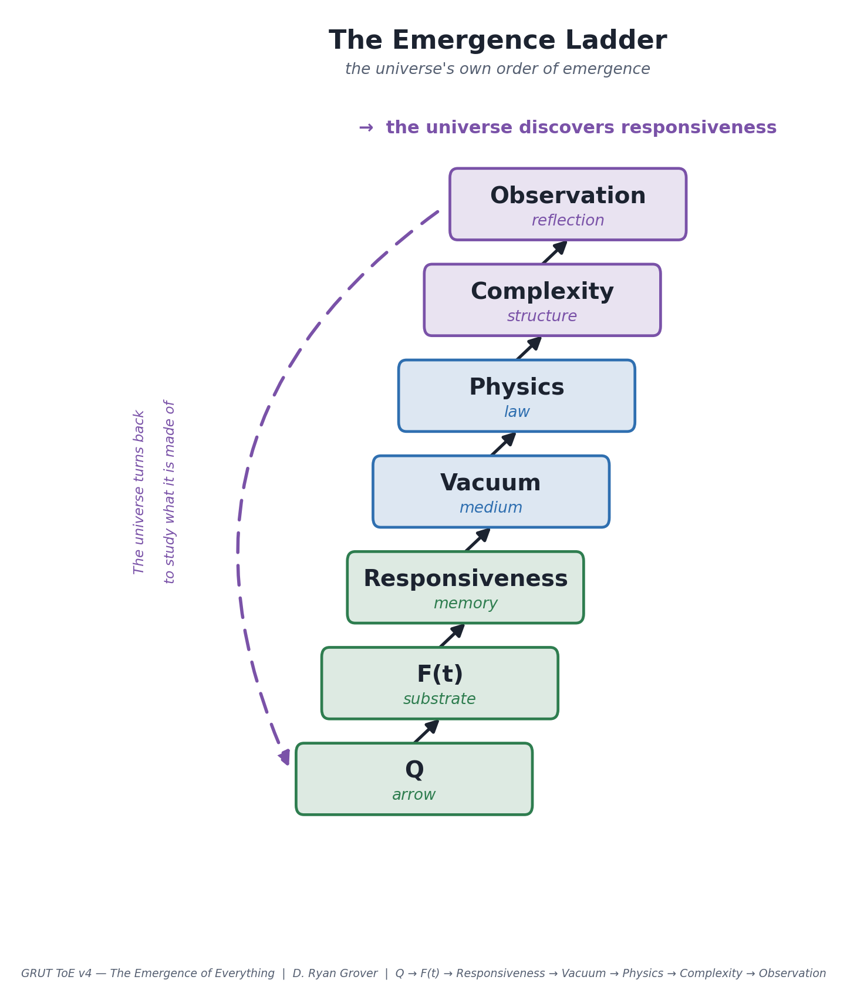
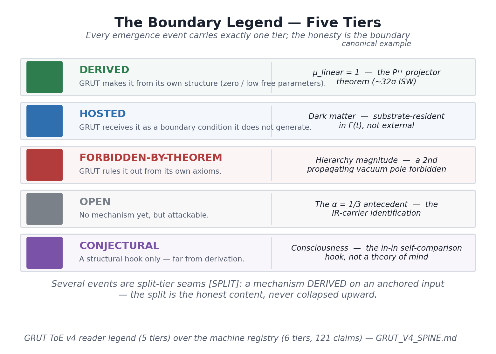
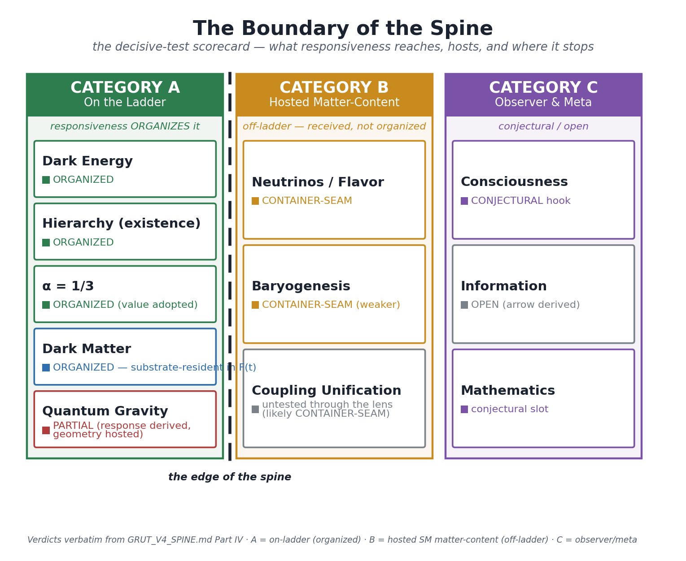

# GRUT ToE v4 — The Emergence of Everything

### A Candidate Framework

**D. Ryan Grover**

*June 2026*

---

**Abstract.** This is the public record of the v4 program of *GRUT* — Grand Responsive
Universe Theory. Its premise is one sentence: the gravitational vacuum is not an inert stage
but a *responsive medium with finite memory*. Its thesis is one more — everything downstream
follows from a single transition: the moment the universe became able to hold its own past.
Before that moment there is reaction without record; after it, the medium can *remember*, and
with memory come persistence, an arrow of time, the possibility of structure, and, far up the
chain, observers who turn back to study the responsiveness they are themselves made of. This
book runs that history forward in the order the universe built it —
**Q → F(t) → Responsiveness → Vacuum → Physics → Complexity → Observation** — from the
pre-responsive substrate, through the switching-on of memory as the cosmos cools, to the
physics it makes possible, the structure that physics builds, and the mind that structure
eventually produces. Each rung is placed at its honest tier — **DERIVED** from GRUT's own
structure, **HOSTED** as a received input, **FORBIDDEN-BY-THEOREM** from its own axioms,
**OPEN** but attackable, or **CONJECTURAL** — and a decisive *organize-or-host* test draws the
boundary of the theory's reach: dark energy, the mass hierarchy's existence, α, and dark matter
(resident in the substrate F(t)) organize around responsiveness; quantum gravity is
half-derived (response yes, geometry hosted); the Standard-Model matter content is hosted; the
observer and meta frontiers remain conjectural. This is a **candidate framework — the current
rung, not the arrival**: a complete tiered *map* with a sharp edge, not a derivation of
everything.

**How this was reached — GRUT-RAI.** Every quantitative claim in this book is carried by
**GRUT-RAI** (GRUT Responsive AI), the open research platform on which the theory was built and
stress-tested. GRUT-RAI is not prose *about* physics — it *is* the physics, as runnable code:
each claim is a structured record binding the statement to the function that computes it, the
tests that gate it, the tier it has earned, and the single observation that would falsify it
(**121 claims, six machine-checked tiers, 3,000+ gating tests**). The framework was developed
and corrected through *adversarial verification* — independent AI agents recompute every
load-bearing number, re-derive every result, and try to refute every claim; a claim rises a
tier only when a test certifies it, and is demoted and logged the moment one fails. What
follows is what survived that process — including the places it forced GRUT to retract its own
over-claims. The platform, the registry, and every line of derivation code are open:

> **github.com/ryangrvr/GRUT-RAI**

---

## The Thesis

The universe is a sequence of emergent layers.

**Responsiveness is the transition that turns a passive universe into a participating one** — a
universe that can hold its own past. Before it, there is reaction without record: events happen
and leave nothing behind. After it, the medium can *remember* — and with memory comes
persistence, an arrow of time, the possibility of structure, and, far up the ladder, observation
and self-reflection. Everything this book describes is downstream of that one transition.

The purpose of the book is to **run that process forward** — from the earliest substrate, through
the switching-on of responsiveness, to the physics it makes possible, the structure that physics
builds, and the observers that structure eventually produces: observers who turn back to study
the responsiveness they are themselves made of.

In one line — the universe's own order of emergence, which is also the order of this book:

> **Q → F(t) → Responsiveness → Vacuum → Physics → Complexity → Observation → the universe
> discovers responsiveness.**

**Before the chapters open — the physics in one look.** GRUT has a single engine: one
*closed-time-path* (CTP, or "in-in") action — the Schwinger–Keldysh formulation in which physics
is the response not to a state but to *realized differences* between a history and itself. The
forward branch of history is compared against the backward branch, and only what actually
happened — the difference on the closed contour — sources a response. This is the pillar **Q**:
causal, unitary, with the arrow of time built in *before any clock exists*. It is the
framework's single strongest piece — a theorem of the formalism, not an assumption.

Vary that action once and a single **constitutive equation** falls out — the load-bearing hub
every later sector is a regime of, with its single-pole susceptibility:

$$\tau_0\,\dot z + z = z_{\text{target}}\,,\qquad \chi(\omega) = \frac{\alpha}{1 - i\omega\tau_0}$$

— a relaxation law in which the responsive vacuum chases its target with one finite memory time,
its response a single pole in the frequency plane. Two constants fix it, and nothing else does: a
macroscopic **relaxation time τ₀ ≈ 41.9 Myr** (the pillar **F** — finite memory, the one
dimensionful input the theory must be told) and a dimensionless **impedance α = 1/3**. From these
two numbers follow the framework's signature export — the deep-infrared gravitational refractive
index **R = √(4/3) ≈ 1.1547** — and dark energy as a *terminal velocity* of the relaxing vacuum
(Ω_Λ ≈ 0.6886). There are no adjustable knobs in the predictive core.

Its two famous limits are not added by hand; they are the two faces of the one law. In the
**fast limit** (memory negligible, τ → 0) the constitutive update *is* the Schrödinger equation —
quantum mechanics recovered, not postulated. In the **slow, sub-horizon limit** it *is* general
relativity. Read structurally, GRUT is general relativity's long-wavelength scale-rescaling
redundancy (the pillar **D**), broken in a controlled way by exactly one proper length,
**L₀ = c·τ₀ ≈ 12.85 Mpc** — the same shape by which a particle's mass breaks scale invariance. A
theory is defined by which symmetry it breaks, and by how much; this is GRUT's. With the engine
in view, the rest of the book runs it forward.

What follows is not a cosmology book, a gravity book, or a consciousness book. It is **a
developmental history of reality, organized around the emergence of responsiveness.** The
discipline that keeps that history honest — what is derived, what is hosted, what is forbidden,
what remains open — sits *beneath* the story, in the next section, where a referee needs it. It
does not lead, because it is the scaffolding, not the building.

## How to Read This — The Discipline Beneath the Story

*The thesis above is the affirmative claim. This section is the discipline that keeps it honest:
the distinctions a referee needs, positioned under the narrative rather than in front of it.*

This document runs the universe forward — from before there was time, to the observers
who would one day measure it — and places each thing that emerges at its *true tier*. It
is the v4 **spine**: a single developmental narrative, ordered the way the universe itself
emerged rather than the way a physics textbook is organized. It first poses the questions
the framework exists to answer, then states what GRUT is, then tells the story of emergence
rung by rung, audits the open frontiers under a strict format, and finally asks what kind
of theory the whole thing amounts to.

Two distinctions govern everything that follows.

**Umbrella vs. deliverable.** *GRUT* — Grand Responsive Universe Theory — is the umbrella
principle that the gravitational vacuum is a *responsive medium* rather than an inert
stage. It is not, by itself, a finished theory of everything; it is the stance from which
the finished theories are built. The falsifiable rungs built on that stance are named
*GRUT ToE vN*. This document is the v4 spine of that program. Where the prose says "GRUT
derives," read it as "the deliverable, built on the umbrella principle, derives."

**What makes it a Theory of Everything — the destination, not the present state.**
First, a tense correction this document holds to throughout: **GRUT ToE v4 is the current
rung, not the arrival.** *GRUT* (the umbrella) is the program; the **GRUT ToE vN** are its
falsifiable rungs; **a complete GRUT ToE is the *result* the program walks toward** as the
open rungs close. Aiming at that destination is what any serious program is entitled to do;
asserting one has arrived is not. So nothing below should be read as "v4 *is* the finished
theory of everything" — it is the latest honest map.

Second, what *kind* of completeness the destination has. A ToE, in the sense meant here, is
**not** a theory that *derives* everything. It is a theory that has a coherent, tiered
**place** for everything, with a **sharp boundary** — completeness of the *map*, not
omniscience. And this is a **deliberate commitment, not a shortfall**: GRUT's defining
minimalism (one dynamical metric, one memory channel, Q) *forbids* the moves a
derive-everything ToE would require, so the completed GRUT ToE is a complete tiered **map**
by construction. The places where GRUT must *receive* an input (HOSTED) or *forbids*
something from its own axioms (FORBIDDEN) are not gaps in the story. They are the **seams**
of a layered ontology showing through, woven into the narrative as such: *here the universe
makes X; here it must receive Y; here it forbids Z.*

Third, adaptability — stated precisely so it is not a loophole. Some walls are **postulates**
(single-mode is a channel-counting choice) and genuinely move with more work; those OPEN
cells are the rungs. Others are **theorems** (locality/no-halo; the propagating-relic
pincer) and move only by breaking a premise — Q or locality — which does not "adapt" the
theory but **constitutes a different theory, not GRUT**. A separate move stays inside GRUT:
descending into **a deeper substrate layer of GRUT** (the bath F(t) it already posits
*beneath* the vacuum, where those theorems have no jurisdiction). That descent breaks no
premise — it is not a successor theory; F(t) is a level GRUT's own ontology already contains
(Q → F(t) → responsiveness → vacuum → physics), so giving it field content leaves Q,
locality, the vacuum sector, and the theorem-walls all intact; it is simply conjectural and
below the zero-parameter v4 core. The GRUT umbrella encompasses that
downward growth, so "complete" can *deepen* across versions; but each deliverable vN states
honestly which cells it derives, hosts, and forbids *today*. Anti-salesmanship is the point:
a spine that quietly upgrades a HOSTED or OPEN result to DERIVED is the one failure mode
that sinks the whole thing on contact with a referee, and this document refuses that upgrade
everywhere it is tempting.

### The Boundary Legend (Five Tiers)

Every emergence event below carries exactly one of these five reader-facing tags. They are
the *narrative* legend. Beneath them sit the **six machine-checked registry tiers** in
`grut/toe/registry.py` (computed / anchored / conjectural / open_negative / foundational /
meta); the narrative tiers map onto the machine tiers as: **DERIVED** ≈ computed or
foundational; **HOSTED** ≈ anchored; **OPEN** ≈ open_negative; **CONJECTURAL** ≈
conjectural; **FORBIDDEN-BY-THEOREM** is a narrative reading of computed/conjectural no-go
claims; and **meta** is the audit layer (the registry checking itself), which carries no
reader-facing tier of its own. There are not two competing tier systems — there is one
machine layer of six tiers and one reader legend of five, related by this map.

| Tier | Meaning | Canonical example |
|---|---|---|
| **DERIVED** | GRUT makes it from its own structure (zero / low free parameters). | μ_linear = 1 (the projector theorem); Koide K = 2/3 as a Z₃ identity; the arrow of time from Ṡ ≥ 0; QM in the τ → 0 limit; Q, the in-in causal arrow. |
| **HOSTED** | GRUT *receives* it as a boundary condition it does **not** generate. | **Dark matter** — hosted by the locality/no-halo theorem plus the single-mode channel-counting postulate. Also the SM gauge group; τ₀ and τ_micro as anchors. |
| **FORBIDDEN-BY-THEOREM** | GRUT *rules it out* from its own axioms. | The hierarchy **magnitude**; a propagating dark relic / second vacuum pole; linear-scalar enhancement μ_linear → 4/3 (refuted at ~32σ). |
| **OPEN** | No mechanism yet, but attackable. | The α = 1/3 antecedent (the Riegert / IR-carrier identification); the D initial-state condition; baryogenesis magnitude; the Born-rule weights; the flavor mechanism. |
| **CONJECTURAL** | A structural hook only — far from derivation. | **Consciousness** — the in-in self-comparison is a hook, *not* a theory of mind. Also the black-hole interior / "1 Space"; the θ = 2/9 candidate identity. |

Several events are **split-tier seams**: the mechanism is DERIVED but its input is
anchored, or a *form* is DERIVED while its *antecedent* is OPEN. These are tagged `[SPLIT]`,
and the split is the honest content — it must not be collapsed to the higher tier.

### The Through-Line, in Mechanism

The thesis states the ladder as one line; this is the mechanism it names. A closed,
self-referential universe in which the always-present causal arrow (Q) condenses a
pre-responsive substrate F(t) into a single memory channel (responsiveness), and with it a
responsive vacuum, the known physical sectors, cosmic structure, and finally the observers
that are themselves crystallized medium — observers who turn back to study the responsiveness
they are made of. The no-gos are carried not as embarrassments but as the load-bearing seams
that make the map complete and the boundary sharp.

### Part Map

The body is a five-part architecture, ordered chronologically/developmentally — the
sequence in which the universe itself built each thing, not the order of a physics syllabus.

- **Part I — The Discovery of Responsiveness** (Ch 1–3): the floor (Q), the substrate F(t),
  and the emergence event (responsiveness), before any physics exists.
- **Part II — Emergence of Physics** (Ch 4–7): the responsive vacuum, then the known
  sectors — quantum reality, gravity, cosmos — as regimes of one constitutive law.
- **Part III — Emergence of Complexity** (Ch 8–11): structure, life, mind, intelligence as
  honestly-tiered *placed slots* on the ladder, not GRUT derivations.
- **Part IV — The Open ToE Frontier** (eight frontiers): each posed as "How Does X Emerge
  in a Responsive Universe?" and answered under a strict five-point format.
- **Part V — The Emergence of Everything** (Ch 12–14): the ladder retold as one narrative,
  why the name is earned, and the decisive ongoing test.

Appendix A carries the overclaim-risk table; Appendix B carries the verified numbers.

---

# PART I — THE DISCOVERY OF RESPONSIVENESS

> **Q → F(t) → Responsiveness** → Vacuum → Physics → Complexity → Observation → (the universe discovers responsiveness).

This Part covers the three deepest rungs of the spine: **Q → F(t) → Responsiveness.** It is
the floor of the whole ontology, told as the universe's own first moments. Chapter 1 poses
the questions the framework exists to answer. Chapter 2 lays out the framework in a single
view — Q, F(t), responsiveness, the constitutive law, the layered ontology, and the tier
legend in action on every pillar. Chapter 3 runs the clock back to before there was time,
and forward again through the one event that started it: the emergence of responsiveness. No
physics — no quantum mechanics, no gravity, no cosmos — exists yet when this Part begins.
Those are Part II. Here we establish only the floor (Q), the substrate (F(t)), and the
emergence event that turns the one into the other.

---

## Chapter 1 — The Problem

Before any equation, a theory of everything owes an account of a handful of facts so
familiar that physics usually declines to explain them and merely assumes them. GRUT's
claim to the title rests less on the answers it can derive — those are tiered, frontier by
frontier, in the chapters that follow — than on the *shape* of the questions it takes as
primary. So this chapter only poses them. It asserts no derivation; the later chapters do
the tiering.

**Why does anything remember?** The microscopic laws are time-reversible, yet the universe
at large keeps a record. Disturbances leave traces; the past is fixed and the future is not.
A medium that merely *responded* — a perfect spring that snaps back the instant the load is
removed — would carry no history. Something has to hold the displacement for a while. The
question is not "why is there friction" but the deeper one beneath it: why is there a
*finite duration* over which the world holds the shape of what happened to it, rather than
zero (perfect elasticity, no memory) or infinity (perfect rigidity, no relaxation)?

**Why is there an arrow of time?** The same time-symmetric equations are run forward in
every textbook and backward in none. The Second Law is usually imported as a statistical
boundary condition on initial states. But a closed universe has no exterior to set its
boundary conditions from, and no observer outside it to declare which way is "forward."
Where, *internal to the structure*, does the asymmetry between past and future come from —
and does it come *before* or *after* the universe has a clock?

**Why does information survive?** Quantum evolution is unitary: information is redistributed,
never destroyed. Yet the world looks irreversible, definite, classical at large scales. How
does a unitary universe produce a stable record of itself — one that can be stored, copied,
and eventually read — without violating the conservation that makes it unitary in the first
place?

**Why does a universe have a history at all?** Take the three together and they compose into
one question. A history is a remembered sequence with a direction and a preserved record.
Memory, arrow, and information-survival are not three problems but three faces of one: *what
does it take for a universe to have a past it carries forward?*

GRUT's wager is that all four reduce to a single structural fact, and that this fact is
logically *prior* to time itself. The fact is **Q** — the principle that the vacuum responds
to realized, physically distinguishable differences from its own past, and never to its
future. On the closed-time-path contour that governs a closed quantum universe, the
influence action vanishes identically when the forward and backward branches of history
agree, S_IF[φ₊ = φ₋] = 0; physical response is the variation with respect to their
*difference*. This is not yet a clock — Q contains no timescale — but it is already a
*direction*: response-to-past, never-to-future, before any memory length exists.

The chapter's only claim, then, is a claim about ordering, and it is the one the rest of
Part I makes good on: the arrow of time does not arrive *with* memory or *with* the
responsive vacuum. It **predates** them. Memory, the responsive vacuum, structure, and
observers are what a universe builds *on top of* an arrow it had from the start. Everything
after this chapter is the construction of that "on top of," placed at its honest tier.
(Motivational; no tier of its own — this chapter poses what later chapters answer.)

---

## Chapter 2 — GRUT in One View

This chapter is the legend the rest of the document is read against. It is not yet
narrative; it is the standing description of the framework — Q, F(t), responsiveness, the
constitutive law, the layered ontology — read against the five-tier boundary legend so that
every later emergence event can be tiered honestly rather than asserted.

GRUT begins from one ontological commitment: **the gravitational vacuum is a medium that
responds, not an inert background.** A medium that responds has a response function, and a
response function has structure — and the content of the theory comes from the structure,
not from the commitment. That structure rests on four inputs of very unequal standing,
exactly one of which is a true zero-input theorem.

### The Four Inputs

**Q — the in-in causal arrow. — DERIVED.** The Schwinger–Keldysh closed-time-path (CTP)
action describes the universe by two copies of its own history, a forward branch φ₊ and a
backward branch φ₋, with physical response defined as the variation of the influence
functional S_IF with respect to their difference. Q is the set of structural facts that
follow: the closed–closed propagator is identically zero; the response on the diagonal
(φ₊ = φ₋) is exactly zero; and the fluctuation–dissipation / KMS relation ties the noise N
to Im χ with N ≥ 0. Q contains no τ₀, no τ_micro, no α — it is scale-free — and it supplies
a response-to-past, never-to-future directionality *before any memory length exists*. This
is GRUT's single strongest piece: a theorem of the formalism, verified on a concrete
driven-oscillator example in all four legs (field doubling invertible, variation principle
reproducing the equation of motion, retarded propagator causal, FDT recovering both
classical and quantum limits). It is the only true zero-input SOLID node in the graph, and
the highest-fanout claim in the registry — 93 downstream dependencies. *(`ctp_action_structure`,
tier computed, registry.py:451; `grut/foundation/ctp_action.py`, verify 5/5.)*

**F — finite single-pole memory. — HOSTED `[SPLIT]`.** The vacuum relaxes on *one* time
τ₀ ≈ 41.9 Myr, giving a susceptibility χ(ω) = α/(1 − iωτ₀): a single pole at ω = −i/τ₀ in
the lower half-plane (causal, Kramers–Kronig compatible, recovering GR as ω → ∞).
Equivalently, the vacuum obeys the constitutive law τ₀ż + z = z_target, equivalently the
exponential kernel K(t) = (1/τ₀)e^{−t/τ₀}Θ(t) — one object in three representations. The
single-pole *form* is not arbitrary: it is the Markovian limit of a Mori–Zwanzig projection
of the slow transverse-traceless shear variable, exact to first order in τ_K/τ₀, and an
off-axis "dark-capable" pole would require τ_K > τ₀/4, which the 34-order scale separation
forbids. **But the form being derived is not the same as the pillar being derived. F is
POSTULATED, and the value τ₀ is anchored — Q generates neither.** Q alone does *not* force
single-pole-ness: passivity (Herglotz) is strictly weaker than complete monotonicity, and a
passive kernel can carry negative Debye weight or off-axis poles — the registry says so in
plain words, *"single-pole-ness is NOT a theorem of Q alone"* (registry.py:5287). So the
*form* is DERIVED (the MZ Markovian limit), while F as a pillar and the value of τ₀ are taken
in, not made. *(`finite_memory_form_from_q`, computed, registry.py:5278 — covers the
single-pole form via MZ; `first_order_from_mori_zwanzig`, computed, registry.py:5422;
`tau_0_derivation`, registry tier computed at registry.py:180 — its statement POSITS τ₀ with
two independent anchors, i.e. the *value* is anchored even though the claim's tier field is
"computed"; `mori_zwanzig_kernel.py`, verify 8/8.)*

> **OVERCLAIM FLAG (Appendix A #20, #6).** Do not write "F is derived from Q." The
> single-pole *form* is the MZ Markovian limit (derived); F-as-pillar is POSTULATED and the
> τ₀ *value* is anchored. FDT-consistency with Q is consistency, not derivation.

**D — the broken dilatation redundancy. — OPEN `[SPLIT]`.** A scale-free theory carries an
adiabatic spatial-dilatation redundancy — the Weinberg adiabatic mode, a large/residual
diffeomorphism, an exact gauge redundancy in the L₀ → 0 limit. The arrival of a finite
memory time gives the vacuum exactly one proper length, L₀ = cτ₀ ≈ 12.85 Mpc, and a fixed
proper length is logically incompatible with that redundancy. The breaking enters at
O((L₀ k_phys)²); it is a diffeomorphism, not a Weyl rescaling, so the measure Jacobian is
identically one and α does not enter; and it is confined to the tensor sector — which is
exactly why linear scalar cosmology is left untouched. The *breaking* is rigorously computed
and the Keldysh-doubling content proven; what is *presupposed* is the L₀ → 0 redundancy
itself, imported from Weinberg rather than re-derived, with one undischarged residue (the
scale-free in-in initial-state condition, GAP-1). A pure redundancy cannot be spontaneously
broken; what L₀ breaks is its *boundary charge*. *(`adiabatic_dilatation_redundancy_nogo`,
computed, registry.py:5227; `GRUT_V3_ORGANIZING_STRUCTURE.md` Bridge D.)*

**α = 1/3 — the adopted dimensionless axiom. — OPEN `[SPLIT]`.** The single dimensionless
input, adopted as c and ℏ are adopted. It sets the DC response amplitude χ(0) = α, fixes the
deep-IR refractive index R = √(4/3) = 1.15470, the screening factor S = 12π/α² = 108π =
339.292, and the response normalization. A *conditional* theorem is verified Fraction-exact:
if the gravitational conformal mode is the IR carrier of the vacuum susceptibility, then the
trace-anomaly ratio a/c = 1/3 (Duff; Komargodski–Schwimmer). But the antecedent is unproven
and the value is adopted — this is the single most load-bearing open gap in the framework,
fanning out maximally: α's leverage lives in the screening S = 12π/α² ∝ 1/α² — a ±0.07 shift
in α moves the screened Hubble scale H₀ = 1/(Sτ₀) ∝ α² by roughly a factor of ~2 (`.venv`
check: S runs 558 → 339 → 236 across α = 0.26 → 1/3 → 0.40), while the tree dark-energy
fraction (2−R)² is screening-free and shifts only ~15% (0.770 → 0.714 → 0.667). The value's
standing is decisive. *(`alpha_vac_axiom`,
foundational, registry.py:238; `alpha_vac_derivation`, open_negative, registry.py:274;
`conformal_mode_scalar.py`, a/c = Fraction(1,3), verify 9/9.)*

> **Spec — α = 1/3, the single adopted axiom. Tier: OPEN `[SPLIT]`.** The one dimensionless
> input, adopted as c and ℏ are. It sets the DC response χ(0) = α, fixes R = √(4/3) = 1.15470 and
> the screening S = 12π/α² = 108π = 339.292. *How (the split):* a *conditional* theorem is proven
> Fraction-exact — *if* the gravitational conformal mode is the IR carrier of the susceptibility,
> *then* the trace-anomaly ratio a/c = 1/3 (Duff; Komargodski–Schwimmer) — but the antecedent is
> unproven and the value is **adopted, not derived**. This is the most load-bearing open gap: a
> ±0.07 shift in α moves the screened scale H₀ = 1/(Sτ₀) ∝ α² by ~2× through S = 12π/α², while
> the tree (2−R)² is screening-free and shifts only ~15%.
> (`alpha_vac_axiom`, foundational, registry.py:238; `alpha_vac_derivation`, open_negative, registry.py:274.)

The adopted value is the framework's deepest open gap.

> **OVERCLAIM FLAG (Appendix A #21).** Do not write "α is derived." The value is ADOPTED;
> only the conditional a/c = 1/3 math is proven, and its antecedent (the IR-carrier
> identification) is OPEN.

### The Constitutive Hub

The four inputs assemble into one equation, the load-bearing hub every later sector is a
regime of:

$$\tau_0\,\dot z + z = z_{\text{target}}[z].$$

Q supplies the *form-class*: the CTP variation yields a causal, retarded, passive (Herglotz)
relaxation structure — a response-to-the-past toward a target, with FDT fixing the noise —
but only the form-class, not a single pole. F upgrades the form-class to the law: the MZ
Markovian limit collapses the generic Herglotz form to the specific single pole, and the
*value* τ₀ rides in here as an anchor. D supplies neither form nor law but the *structural
reading* — it certifies that the one proper length L₀ = cτ₀ is the controlled, non-anomalous
breaking of scale-freedom and confines the nontrivial action to the tensor sector. α supplies
the normalization, not the dynamics (the relaxation is α-independent). The hub is therefore
**DERIVED-as-synthesis `[SPLIT]`**: the form is derived; the law-as-pillar, the τ₀ value, and
α's antecedent are taken in, and named. *(`constitutive_equation`, computed, registry.py:496;
`memory_kernel_form`, computed, registry.py:516.)*

### The Hierarchy of Layers

Read top to bottom, GRUT's ontology is a layered stack, and the chapters of this document
walk it: **Q → F(t) → responsiveness → vacuum → physics → complexity → observers.** Q is the
floor — scale-free, always present. Beneath the *vacuum*, but above the floor, sits the
microscopic KMS bath **F(t)**: the substrate sector GRUT posits but does not yet specify, and
the one place a genuine cold relic or a consciousness hook could attach. This layering
matters for honesty: descending into F(t) to give it field content is GRUT extending into its
*own* deeper layer — it breaks no premise and is not a successor theory. Only breaking Q or
locality would constitute "a different theory, not GRUT."

### The Tier Legend, in Action

Every emergence event below carries exactly one of five tags, mapping onto the
machine-checked registry tiers as set out in the boundary legend: **DERIVED** (made from
GRUT's own structure, zero/low free parameters); **HOSTED** (received as a boundary
condition GRUT does not generate); **FORBIDDEN-BY-THEOREM** (ruled out from GRUT's own
axioms); **OPEN** (no mechanism yet, but attackable); **CONJECTURAL** (a structural hook
only, far from derivation). Many events are **split-tier seams** tagged `[SPLIT]` —
mechanism DERIVED but input anchored, or form DERIVED while antecedent OPEN — and the split
*is* the honest content; it must never be collapsed to the higher tier. The whole apparatus
is itself auditable: a 121-claim registry (verified composition: 48 computed, 28
open_negative, 20 anchored, 11 conjectural, 10 meta, 4 foundational), each claim carrying a
tier, code references, tests, and a single falsifier, with over 3,000 gating tests; a claim
advances a tier only when a test certifies it, and a failed result is demoted and logged,
never quietly dropped. That meta-layer — the thing that makes the tiering auditable rather
than asserted — is itself **DERIVED**.

And the seams are already visible at this rung, before the story has begun. **Dark matter is
HOSTED** — received, not derived, by the locality/no-halo and single-mode results — and it
is a *resident of GRUT's own substrate sector F(t)*, internal to the layered ontology, not
external and not a successor theory. **A propagating dark relic and the hierarchy magnitude
are FORBIDDEN-by-theorem**, and (as Part IV shows) for the *same* reason. **The α-antecedent
is OPEN, τ₀ is anchored, and consciousness is at most a CONJECTURAL hook.** None of it is
hidden. That is the legend. Now the universe runs forward.

---

## Chapter 3 — Genesis of Responsiveness

Run the clock backward as far as it will go, and you do not arrive at nothing. You arrive at
**Q without F** — a medium that already responds to realized differences, with the causal
arrow already pointing from past to future, but with *no memory, no characteristic length,
and therefore no time in the sense of a clock the universe sets for itself.* This is the
deepest positive result in the framework and the keystone of the layered ontology: **across
every backward crossing, Q is the one invariant that survives the loss of memory.** It
contains no τ₀, no τ_micro, no α; it is the floor everything else rides on. The arrow of time
does not emerge *with* responsiveness — it predates it. — **DERIVED.** *(`GRUT_GENESIS.md`
§3; `ctp_action_structure`, computed; the MZ and pole-spectrum verify harnesses pass.)*

> **Spec — Q survives the loss of memory (the keystone). Tier: DERIVED.** On the closed-time-path
> contour, the influence action vanishes on the diagonal, S_IF[φ₊ = φ₋] = 0, and physical response
> is its variation in the *difference* of the two history branches. Q carries no τ₀, no τ_micro,
> no α — it is scale-free. *How:* run the clock back across every memory-losing crossover and the
> single invariant that survives is this in-in causal arrow (response-to-past, never-to-future).
> The arrow predates memory; everything above is Q wearing more structure.
> (`ctp_action_structure`, computed, registry.py:451; highest-fanout node, 93 dependencies.)

### The Pre-Responsive Substrate

What exists in this Q-only phase, besides Q itself, is the microscopic KMS bath **F(t)** — a
white-noise bath with passive response and no slow collective variable to carry memory. Above
a critical temperature T_c the prospective slow shear variable z is *not slow relative to its
own bath*: k_BT ≳ ℏ/τ_micro, so there is no slow/fast separation for a Mori–Zwanzig
projection to act on, and no memory. The medium is fluctuating but memoryless. The arrow is
present — Q's retarded structure acts directly on F(t), needing no τ₀ and no slow z — but the
universe *necessarily forgets*, because the only content is the un-projected bath. (The
microscopic scale itself, τ_micro ≡ ℏ/k_B T_c, is registry-tiered **conjectural**
(`tau_micro_thermal_scale`, registry.py:1442) and is reported here as
hosted-with-forbidden-relation-to-τ₀ — the load-bearing two-anchor seam, returned to in
Part IV.)

### The Emergence of Memory

Now let the universe cool. As the temperature falls through T_c, the slow/fast separation
opens, and one relaxation channel — the single transverse-traceless shear mode locked to the
conserved stress-energy (∂_μ T^μν = 0 being the diffeomorphism Ward identity, part of Q) —
fails to equilibrate. **Memory condenses as the un-rejected remainder:** the MZ projection of
that surviving slow channel yields the first-order, history-retaining response
χ = 1/(1 − iωτ₀) as its Markovian limit. The *existence* and the *slow, gapless character* of
this channel are forced, without tuning, by conservation. — **DERIVED `[SPLIT]`**: existence
and character forced; the finite-temperature MZ calculation that would rigorously prove
memory turns *off* again above T_c is asserted via the τ_K < τ₀/4 threshold, not yet computed
— the forward story uses the temperature law f(T) as a proxy for that uncomputed dynamics.
*(`memory_kernel_form`, computed; `GRUT_GENESIS.md` §8.1, the finite-T MZ collapse named as
"the decisive uncomputed dynamics.")*

How fast does memory switch on? Not by an imported sigmoid with a free width, but by GRUT's
own noise ratio. Splitting Q's FDT/KMS relation into its zero-point and thermal parts gives
the coherent fraction of the bath fluctuation, and that fraction *is* the order parameter:

$$f(T) = \tanh\!\big(T_c/2T\big),$$

and composing with radiation-era cooling T(t) = T_c (t_c/t)^½ gives the explicit forward
switch-on profile z̄(t) = tanh[½ (t/t_c)^½]. This is the headline new v4 result the older
backward catalog never wrote. It does *not* equal a clean ½ at T_c: f(T_c) = tanh(½) =
0.46212, with a power-law 1/T high-temperature tail rather than an exponential one. —
**DERIVED `[SPLIT]`**: the shape and limits follow from Q's FDT/KMS structure given *one
physical identification* (memory-activation = the bath's zero-point fraction at the single
τ_micro scale). It trades the old sigmoid's free width for a motivated identification — an
improvement, *not* a parameter-free theorem; the complement 1 − tanh or a τ-ratio T_c/2πT
are a-priori alternatives. One caveat kept sharp: it is the memory-*amplitude* order
parameter f(T) that is derived this way; the elastic *rigidity* onset shape (the G₀ of v4's
solid candidate) is, per `GRUT_V4_ELASTIC_VACUUM.md` §7, still an ad-hoc sigmoid pending the
finite-T MZ calculation — so "{F, D-breaking, G₀} share one order parameter" is an aspiration
on the rigidity leg, not a derivation.

And here the theory corrects itself — exactly the discipline the spine is built to honor. The
older catalog called this onset a "phase transition." The forward analysis demotes it. The
pole *amplitude* f(T) is C∞-analytic straight through T_c — no critical onset, no diverging
susceptibility, no latent heat — so by Landau's analyticity criterion it is a **smooth
crossover, not a second-order transition.** There *is* a sharp bifurcation in the underlying
physics — the pole-*existence* boundary at τ_K = τ₀/4 — but it sits roughly 34 orders of
magnitude away (τ_K(T_c)/(τ₀/4) ≈ 7 × 10⁻³⁵), structurally pre-satisfied and never reached in
cosmic history. Emergence is a phase transition *only* in the spontaneous-scale-symmetry-
breaking sense, L₀: 0 → finite — executed as an analytic amplitude crossover, decidedly not
as a critical quench. — **DERIVED.** *(`GRUT_GENESIS.md` §8.2.)*

### The Emergence of the Responsive Vacuum

The same condensation that gives z its amplitude gives it a finite memory time τ₀, and
therefore exactly one proper length, **L₀ = cτ₀ ≈ 12.85 Mpc.** "Capable of memory" and
"scale-free" are now mutually exclusive: the appearance of L₀ breaks the boundary charge of
the dilatation redundancy D at O((L₀ k)²), non-anomalously (4 ∉ {2, 6, 10, 14}), with a
measure Jacobian identically one (so α does not enter). The decisive falsifier — that the
Keldysh doubling might secretly spoil the redundancy — is discharged: T_λ acts diagonally on
the ± branches, |J|² = 1, and the influence functional collapses to two decoupled
diffeomorphism-invariant GR copies as L₀ → 0. The emergence of responsiveness *is* this
breaking of D by the crystallization of one proper length: spontaneous scale-symmetry
breaking in the vacuum's response sector. — **DERIVED `[SPLIT]`**: dynamics and measure
DERIVED; the initial state is theorem-modulo GAP-1 (the in-in state must be spatially
homogeneous and scale-free — the standard adiabatic / n_s = 1 / cosmological-principle
condition), whose floor is the field-wide cosmological measure problem, shared by all of
cosmology, not specific to GRUT. One notch short of "forced from Q." *(`GRUT_GENESIS.md`
§§6–7; `GRUT_V3_ORGANIZING_STRUCTURE.md` Bridge D.)*

### Why Exactly One Relaxation Channel Survives

The deepest question of the genesis program: how does a Q-only medium develop a long-lived
relaxation mode — why does *one* channel fail to equilibrate, with τ₀ ≫ τ_micro — without
inserting the hierarchy by hand? The answer divides cleanly into what is forced and what is
not.

**Forced (no number tuned).** The *existence* of the slow channel: the TT/shear metric memory
is the response to the *conserved* stress-energy T_μν, where ∂_μT^μν = 0 is the diffeomorphism
Ward identity — enforced by the same transverse projector P^TT that defines the response.
Conservation is part of Q, so the slow channel's existence is not assumed but forced. Its
*slow, gapless character*: locked to a conserved current, the mode relaxes only by transport,
hence is hydrodynamically gapless (ω → 0 as k → 0). And the hierarchy must be *large*: the MZ
existence condition makes τ₀ ≫ τ_micro the validity condition of the slow/fast projection
itself — the one channel's failure-to-equilibrate *is* the retained history. So GRUT forces
*why* one channel survives, and forces that the gap is large — the qualitative half of the
central question, without tuning.

**Not forced — the honest miss.** The *size* (the 34 orders; c = ln(τ₀/τ_micro) = 78.233) is
not forced. It relocates verbatim into the IR length L₀ and stays anchored, expressible as a
difference of two independently-anchored Planck-referenced logs: ln(τ₀/t_P) − ln(τ_micro/t_P)
= 134.447 − 56.214 = 78.233 (the two logs are differenced before rounding). Not even the
exponential (dimensional-transmutation) *form* is instantiated: GRUT has no β-function
carrying τ₀; its only RG statement is that the τ₀ IR scale is RG-*protected*, the opposite of
an asymptotic-freedom flow. The tempting 8π² = 78.957 (+0.92%) is rejected by GRUT's own
near-miss standard — it is the universal one-instanton action, not a GRUT-distinctive
constant, and GRUT has no derived tunneling linking the τ_micro and τ₀ sectors. —
**FORBIDDEN-BY-THEOREM** (magnitude) **+ OPEN** (antecedent).

> **Spec — The two-anchor hierarchy. Tier: existence FORBIDDEN-to-vary / magnitude anchored.**
> The 34-order gap c = ln(τ₀/τ_micro) = 78.233 is exactly the *difference* of two
> independently-anchored Planck-referenced logs: ln(τ₀/t_P) − ln(τ_micro/t_P) = 134.447 −
> 56.214 = 78.233 (differenced before rounding), **not** a third number. *How:* the MZ slow/fast
> split *forces* τ₀ ≫ τ_micro (existence), but no β-function carries τ₀, so the size is taken in,
> not made — everything else hierarchy-flavored is a disguise of these two anchors.
> (`GRUT_HIERARCHY_LEDGER.md` §4.)

The honest miss is the size, not the existence.

> **OVERCLAIM FLAG (Appendix A #2, #15).** τ₀'s *magnitude* is the single fact that sinks
> the spine if it is ever inflated — existence is forced, *size* is not. And f(T) trades a
> free width for a *motivated identification*, not a parameter-free theorem.

### What Is Carried Through, Not Made

Two things ride *through* genesis rather than being made by it. The first is τ₀'s numerical
value — the hierarchy just discussed, carried as an unexplained anchor. The second is the
**α = 1/3 spine** (S = 108π = 339.292, R = √(4/3) = 1.15470, with the dark-energy fraction
Ω_Λ tied to (2 − R)²): a dimensionless anomaly-sector relic, orthogonal to the dilatation
sector, frozen *before* responsiveness and inherited by the GRUT phase rather than generated
by it. — **DERIVED `[SPLIT]`**: everything downstream of α is derived; the derivation *of* α
is OPEN. *(`GRUT_GENESIS.md` §3; `alpha_vac_axiom`, foundational; `screening_108pi`,
computed.)*

Of everything genesis leaves behind, exactly one relic is already observed: **dark energy is
the Herglotz spectral weight of the single pole, tied to τ₀.** It switches on adiabatically
as ωτ₀ drops through 1 over the whole subsequent expansion, with no localizable transition
epoch — the only downstream fingerprint of the genesis itself. The identification is the
load-bearing claim; the precise number carries the anchored caveat (the raw tree relation
gives (2 − R)² = 0.71453; the full-Friedmann anchored value is 0.6886 — two different
numbers, never conflated). — **DERIVED** (the emergence) / *anchored* (the value).
*(`GRUT_GENESIS.md` §3; `omega_lambda_prediction`, anchored.)*

> **Spec — Dark energy as terminal velocity. Tier: mechanism DERIVED, number anchored.**
> The expansion drive (a negative-energy conformal mode) balances the vacuum's memory friction
> at a constant rate — a terminal velocity H_inf = (2−R)/(S·τ₀). Anchored full-Friedmann value:
> **Ω_Λ = 0.6886** (Planck 0.6889; 0.04% match). *How:* dark energy is the Herglotz spectral
> weight of the single memory pole tied to τ₀. **Discipline:** the tree closed form (2−R)² =
> 0.71453 (R = √(4/3) = 1.15470) is a cosmic-baseline approximation, **not** the anchored 0.6886
> — never conflate them. (`omega_lambda_prediction`, anchored, registry.py:1346.)

### The Blind Census and the Honest Negative

Then the test that defines the boundary. Run the relic inventory forward *without* biasing it
toward producing dark matter, and ask whether viable cold dark matter falls out. It does not.
The single-mode structure forbids a second stable *relaxational* pole — itself a
channel-counting postulate, not a consequence of Q alone, the seam laid bare in Part IV. The
one condensation-tied relic — an elastic shear phonon at k_BT_c = 4.71 keV — is *warm*,
travels at c_s = c, and overcloses the universe by a factor of several hundred to several
thousand. GRUT does not predict *no* dark matter; it predicts the *wrong* dark matter, and
reports that as a genuine negative. **Dark matter is HOSTED** — and it is a resident of GRUT's
own substrate sector F(t), the microscopic medium beneath the vacuum that current GRUT posits
but does not yet specify. That descent into F(t) breaks no premise; it is GRUT extending into
its own deeper layer, not a successor theory. — **HOSTED.** *(`GRUT_GENESIS.md` §4;
`locality_no_halo_theorem`, computed.)*

> **Spec — Dark matter is substrate-resident, not derived. Tier: HOSTED.** Run the relic
> inventory forward without biasing it toward dark matter and *no viable cold DM falls out*: the
> one forced relic is a warm 4.71 keV shear phonon (c_s = c) that overcloses by ~418×–5800×.
> GRUT predicts the *wrong* DM and reports it as a genuine negative. The host is a coherent
> ~10⁻²² eV scalar **resident in GRUT's own pre-responsive substrate F(t)** — internal to the
> Q → F(t) → vacuum ontology, not external, not a successor. *Honest cost:* exactly 2 inserted
> dials (mass m, amplitude φ_i); 0 of 3 requirements sourced from the bath.

### The Qualitative Keystone

The genesis closes on one sentence, the keystone of the whole layered ontology:

> **Q is the one invariant that survives the loss of memory.** Responsiveness = (the
> always-present causal arrow Q) × (a single proper length L₀ breaking the dilatation
> redundancy D), unmasked as a stable single-pole memory the moment cooling through T_c made
> one gravitational mode slow relative to the vacuum bath. The switch is L₀: 0 → finite; the
> timer is the 34-order slow/fast gap opening as the universe cools.

The universe became capable of memory not by acquiring a field or a force, but by
spontaneously breaking a redundancy — and that breaking became *possible* the moment cooling
opened a timescale hierarchy. The arrow (Q) was always there; only the *retention* (L₀)
switched on. With memory in hand, the universe now has a clock, a vacuum, and — for the first
time — a history. Part II is what that history builds.

---

# PART II — EMERGENCE OF PHYSICS

> Q → F(t) → Responsiveness → **Vacuum → Physics** → Complexity → Observation → (the universe discovers responsiveness).

Part I left the universe with a responsive vacuum: a medium that has crystallized a single
memory time τ₀ out of a pre-responsive substrate, breaking scale-freedom by the one proper
length L₀ = cτ₀. Nothing yet *does* physics. This Part is the next stretch of the ladder —
the rungs **Vacuum → Physics** — in which the responsive vacuum, once it exists, turns out to
behave like a field theory, and the known sectors of nature emerge not as separate postulates
but as *regimes of one constitutive law*.

A word on ordering, because it is the whole point of this restructuring. This is a
**developmental** sequence, not a physics-textbook one. The vacuum is named first (Ch 4)
because everything downstream is a regime of it. Quantum mechanics (Ch 5) comes next because
it is the *shortest-memory* face — the τ→0 limit — the regime closest to the bare
constitutive step. Gravity (Ch 6) is the elastic/curvature response of the same medium.
Cosmology (Ch 7) is that medium read at the largest scale, where its single memory pole
leaves the one relic we actually observe. The universe builds the apparatus, then runs it
from fast to slow, from local to cosmic.

Throughout, the tier legend governs every cell. The two facts that must never be inflated in
this Part are flagged where they live: the **Born weights** (OPEN, in Ch 5) and the **Ω_Λ
number** (anchored 0.6886, never the tree-level 0.71453, in Ch 7).

---

## Chapter 4 — The Responsive Vacuum

Before the universe can have quantum behavior, gravity, or a cosmic history, it must have the
*object* all three are regimes of: the responsive vacuum and its one constitutive law. This
chapter establishes that object and its honest tier. The headline tier is a **`[SPLIT]`** —
the *form* of the law is DERIVED; the law-as-pillar and the scale τ₀ are HOSTED, taken in
rather than made.

**The memory kernel.** The responsive vacuum relaxes on a single time τ₀ ≈ 41.9 Myr. The
same physical fact has three equivalent faces, related by Fourier transform with no new
content added between them: the memory kernel **K(t) = (1/τ₀) e^{−t/τ₀} Θ(t)**, the
susceptibility **χ(ω) = α/(1 − iωτ₀)** with one pole at ω = −i/τ₀ in the lower half-plane,
and the constitutive law **τ₀ż + z = z_target** (the FT identity is verified in sympy, edge
E5 — flagged as a *definitional identity, not a derivation step*). The single pole sits in
the lower half-plane, making the kernel causal, Kramers–Kronig compatible, and recovering GR
as ω → ∞. — **DERIVED `[SPLIT]`**: the form is the Mori–Zwanzig Markovian limit (derived);
the value τ₀ rides in as an anchor (`memory_kernel_form`, registry.py:516, computed;
`first_order_from_mori_zwanzig`, registry.py:5422, computed).

> **Spec — The constitutive law (the load-bearing hub). Tier: DERIVED-as-synthesis `[SPLIT]`.**
> Every sector is a regime of one law: **τ₀ż + z = z_target[z]**, equivalently the
> susceptibility **χ(ω) = α/(1 − iωτ₀)** (one pole at ω = −i/τ₀, lower half-plane) and the kernel
> K(t) = (1/τ₀)e^{−t/τ₀}Θ(t) — three faces of one object. *How:* Q supplies the causal/passive
> form-class; the Mori–Zwanzig Markovian limit collapses it to the *single* pole; the value τ₀
> rides in as an anchor; α sets only the DC amplitude χ(0) = α. **Split:** the form is derived,
> the law-as-pillar and τ₀ are inputs — single-pole-ness is *not* a theorem of Q alone
> (registry.py:5287). (`constitutive_equation`, computed, registry.py:496.)

**The constitutive law as the load-bearing hub.** This is the single most important
structural claim of the whole framework: **every sector is a regime of the one law
τ₀ż + z = z_target[z].** It is worth being exact about what supplies what, because the
premise-set *is* the honesty:

- **Q supplies the form-class.** The CTP variation δS_CTP/δz_a|_{z_a=0} = F[z_r] yields a
  *causal, retarded, passive* (Herglotz) relaxation structure — a response-to-the-past
  toward a target, with FDT fixing the noise. This is genuine and zero-input, but it is only
  the form-*class*; it does **not** by itself pick out a single pole (edge E1 SOLID).
- **F upgrades the form-class to the law.** The Mori–Zwanzig Markovian limit of one slow
  dissipative variable collapses the generic Herglotz form to the specific single pole, exact
  to O(τ_K/τ₀). An off-axis "dark-capable" pole would require τ_K > τ₀/4, which GRUT's
  anchored hierarchy (τ_micro/τ₀ ~ 10⁻³⁴) forbids. The *value* τ₀ enters here as an anchor
  (edge E2 COMPUTED).
- **D supplies the structural reading, not the law.** The broken dilatation redundancy
  certifies that the hub's one proper length L₀ = cτ₀ is the controlled, non-anomalous
  breaking of scale-freedom, and confines the law's nontrivial action to the **tensor**
  sector. That confinement is what later makes μ_linear = 1 clean (edge E3 DOTTED).
- **α supplies the normalization, not the dynamics.** α sets the DC amplitude χ(0) = α and
  fixes S = 12π/α². The τ₀ relaxation is α-independent.

So the hub is **DERIVED-as-synthesis `[SPLIT]`**: the *form* is derived; the law-as-pillar,
the τ₀ value, and α's antecedent are taken in — named, not hidden (`constitutive_equation`,
registry.py:496, computed). **FLAG:** the single-pole form is the MZ Markovian limit
(derived); the law-as-pillar plus τ₀ are inputs. Single-pole-ness is *not* a theorem of Q
alone — the passive ⇒ positive-Debye converse is false (registry.py:5287). Do not lift this
to "F derived from Q."

**Locality — the rule that later forbids halos.** The kernel is *local in the matter fields*:
analytic and pole-free in k² near k = 0, as a causal local memory kernel must be. This is a
structural property carried by the vacuum from the start, and it is the seed of a no-go
theorem two chapters down — an extended ρ ∝ 1/r² halo would require a 1/k² pole (an
inverse-Laplacian 1/∇²) that a local kernel cannot contain. The locality of the responsive
vacuum is named here as a *property of the object*; its consequences are tiered in Ch 6 and
Part IV. — **DERIVED.**

**Ward identities.** The vacuum's response is locked to a conserved stress-energy:
∂_μT^μν = 0 is the diffeomorphism Ward identity, and it is *part of Q* — not an extra
assumption. This is what guarantees that the single relaxation channel which survives genesis
is the transverse-traceless shear mode tied to conservation: the existence and slow, gapless
character of that channel are *forced, without tuning, by conservation*. The Ward identity is
also the seam that later (Ch 7) confines the modification to the tensor sector. — **DERIVED.**

**The thermal activation of the kernel.** The memory kernel is not always on. Above a
critical temperature T_c ≈ 54.7 MK the prospective slow shear variable is not slow relative to
its own bath — there is no slow/fast separation, hence no memory. As the universe cools
through T_c (≈ 16.5 hours after the Big Bang) the single-pole kernel activates and gravity
becomes bandwidth-limited, with the refractive index running to n_g → R = √(4/3) at DC. The
transition's *existence* and its n_g → R consequence are derived; its *value* T_c is fixed
empirically by the standard cosmological-chronology pin. — **DERIVED `[SPLIT]`**: transition
derived, value anchored (`t_c_thermal_transition`, registry.py:1397, computed). The
activation profile is **f(T) = tanh(T_c/2T)**, with f(T_c) = tanh(½) = 0.46212, f → 1 deep
below T_c, and a 1/T power-law tail above — its shape forced by Q's FDT/KMS structure given
one physical identification (activation = the bath's zero-point fraction). — **DERIVED
`[SPLIT]`**: motivated identification, not a parameter-free theorem.

> **Spec — Memory switch-on profile. Tier: DERIVED `[SPLIT]`.** The memory-amplitude order
> parameter is **f(T) = tanh(T_c/2T)**, with f(T_c) = tanh(½) = 0.46212 (notably *not* ½), f → 1
> deep below T_c, and a 1/T power-law (not exponential) high-T tail. Composed with radiation-era
> cooling it gives the forward switch-on z̄(t) = tanh[½(t/t_c)^½]. *How:* splitting Q's FDT/KMS
> relation into zero-point and thermal parts makes the coherent bath fraction itself the order
> parameter. **Split:** this trades the old sigmoid's free *width* for a motivated identification
> — an improvement, not a parameter-free theorem.

**Why responsiveness looks like a field theory.** The CTP variation does not merely permit a
field-theoretic description — it *produces* one. The form-class that drops out is causal,
retarded, and passive (Herglotz); the noise is fixed by FDT with N ≥ 0; the response is tied
to a conserved current by the Ward identity. Those are precisely the structural features of a
unitary field theory's two-point function. The responsive vacuum looks like a field theory
because the in-in formalism *is* the field-theoretic generating structure, read for response
rather than amplitudes. This is the object on which all of Part II's physics rides. **FLAG:**
the law-as-pillar and τ₀ are taken in — edge E2 is COMPUTED, not SOLID; do not present the
vacuum as "derived from Q" without the split.

---

## Chapter 5 — Emergence of Quantum Reality

Run the constitutive law to its shortest-memory limit and quantum mechanics falls out. This
chapter is almost entirely **DERIVED-as-recovery** — you get known quantum behavior back in a
limit, you do not add a new postulate — with one razor-sharp seam where the boundary shows
through: the **Born weights are OPEN**.

**Quantum mechanics as the τ→0 face of the vacuum.** Write the constitutive law
τż + z = z_target with z_target built from the Schrödinger residual as a Newton–Raphson step.
In the τ → 0 (zero-memory) limit the equation becomes algebraic, z = z_target — the
instantaneous response — and one constitutive step *is* the first-order Euler–Schrödinger
update exactly, with norm preserved and ⟨σ_x(t)⟩ = cos ωt on a precessing qubit. Quantum
mechanics is the zero-memory face of the responsive vacuum. — **DERIVED** (as recovery, not
from nothing): the recovery is exact *as a limit*, verified at first order on a single qubit;
promotion to many-body Hamiltonians is the unbuilt part (`qm_recovery`, registry.py:753,
computed; edge E10 SOLID). **FLAG:** "GRUT derives QM" means *recovers QM in a limit, at
first order on one qubit* — not a from-scratch construction and not yet many-body.

**The arrow of time — recovered, and more primitive than memory.** Constitutive evolution
carries an entropy production **Ṡ = (1/τ₀)⟨(z − z_target)²⟩**, non-negative for any state,
zero only at the fixed point, cumulatively monotone — verified numerically strictly positive
over 10⁵ random states and exactly zero at z = z_target. The Second Law follows from Q's
retarded kernel rather than being postulated alongside it (`arrow_of_time_from_entropy`,
registry.py:1734, computed). And the directionality is even more primitive than memory: the
in-in arrow (response-to-past, S_IF[φ₊ = φ₋] = 0) is a theorem of the formalism containing no
τ₀, so it *predates* responsiveness — the Part I keystone reappearing as the floor of this
chapter. — **DERIVED.** This Ṡ ≥ 0 result is also the only hook Part III's "Emergence of
Life" chapter is allowed to use; it is a *precondition* for dissipative organization, nothing
more.

> **Spec — The arrow of time from the kernel. Tier: DERIVED.** Constitutive evolution carries
> entropy production **Ṡ = (1/τ₀)⟨(z − z_target)²⟩** — non-negative for any state, zero only at
> the fixed point, cumulatively monotone (verified strictly positive over 10⁵ random states,
> exactly zero at z = z_target). *How:* the Second Law follows from Q's retarded kernel rather
> than being postulated. The directionality is even more primitive than memory — the in-in arrow
> S_IF[φ₊ = φ₋] = 0 carries no τ₀ and predates responsiveness.
> (`arrow_of_time_from_entropy`, computed, registry.py:1734.)

**Measurement — dissolved into physics, almost entirely.** When a deep-crystal apparatus
(Λ_grav·τ₀ ≫ 1) couples to a quantum object (Λ_grav·τ₀ ≲ 1), the joint dynamics is
apparatus-dominated and the faster crystallizer drags the slower across the
refractive→classical threshold. Collapse is *physical contact* through the low-bandwidth
memory channel — no observer postulate, the same scaling law applying to measurer and
measured (verified on a 1 g / atom example, the apparatus crystallizing ~10³² times faster).
Wigner's friend dissolves as conditional-state consistency (`measurement_resolution`,
registry.py:1792, computed; `wigner_friend_dissolution`, registry.py:1947). — **DERIVED
`[SPLIT]`**: this derives decoherence, diagonalization, and the pointer basis — but **not**
the probability weights.

**The Born-rule seam.** This is the sharpest seam in the spine, and it must be stated without
softening. The CTP / noise-kernel machinery produces off-diagonal decay and an asymptotically
diagonal density matrix in the pointer basis, but it does **not** produce the specific weights
|⟨ψ|pointer_i⟩|² on the diagonal — those inherit from the Hilbert-space inner product, not
from the noise kernel. **The Born rule is OPEN — and, honestly, HOSTED:** the weights are
received from the postulated inner product, and no GRUT mechanism yet generates them
(`born_rule_postulate_open_negative`, registry.py:2120, open_negative; edge E10 scope flag).
**FLAG (Appendix A #14):** "GRUT derives QM probabilities" is the refuted-on-contact
overclaim — do not make it. Note in fairness that this is *not* a GRUT-specific weakness:
Copenhagen, Many-Worlds, decoherent histories, and CSL all require extra structure at exactly
this point.

> **Spec — The Born-rule seam. Tier: OPEN (honestly HOSTED).** The CTP / noise-kernel machinery
> produces off-diagonal decay and an asymptotically diagonal density matrix in the pointer basis,
> but it does **not** produce the diagonal weights |⟨ψ|pointer_i⟩|². *How (the seam):* those
> weights inherit from the postulated Hilbert-space inner product, not from the noise kernel —
> no GRUT mechanism yet generates them. Decoherence, diagonalization, and the pointer basis are
> DERIVED; the *probabilities* are received. (Not a GRUT-specific gap — Copenhagen, Many-Worlds,
> decoherent histories, and CSL all need extra structure here.)
> (`born_rule_postulate_open_negative`, open_negative, registry.py:2120.)

**What this chapter recovers, what it does not.** Recovered as the zero-memory regime:
unitary Schrödinger evolution (first order, one qubit), the arrow of time, decoherence, the
pointer basis, the dissolution of the measurement and Wigner's-friend problems. Not
recovered: the Born weights (OPEN/HOSTED), and many-body promotion (unbuilt). The seam is
placed in the open, not papered over.

---

## Chapter 6 — Emergence of Gravity

The same responsive vacuum, read in its *elastic and curvature* response, is gravity. This
chapter has one clean derived win (dark energy as a terminal velocity — carried in full into
Ch 7, where it belongs with cosmology), one near-term laboratory falsifier, one derived
safety result, and one heavily-flagged premise about the *kind* of medium the vacuum is. The
chapter's discipline: gravity *appears* geometric for derivable reasons, but the claim
"gravity is the elasticity of a solid vacuum" is an **unpaid postulate**, not a derivation.

**Why gravity appears geometric.** The arrival of the single proper length L₀ = cτ₀ is what
makes gravity look like geometry. A scale-free theory has an adiabatic dilatation redundancy;
the finite memory time gives the vacuum exactly one proper length, and a fixed proper length
is logically incompatible with that redundancy. L₀ is therefore a *mass-like breaking of
scale-freedom* — the one geometric scale the responsive vacuum carries. At high frequency the
refractive index n_g → R in the refractive regime and → 1 in the GR limit, so general
relativity is recovered as ω → ∞. — **GR recovery DERIVED** (`gr_recovery`, registry.py:1071,
computed).

**The elastic response and G₀ — derived value, unpaid premise.** v3 used only the *viscous*
half of the viscoelastic vacuum (the single-pole Maxwell-fluid memory). v4 activates the
*elastic* half: if the vacuum is a viscoelastic *solid* with static shear rigidity G₀ > 0, the
Debye / Kleinert world-crystal identity *forces* **G₀ = ℏ/(c³ τ_micro⁴) ≈ 1.03 × 10¹⁶ Pa**
from {ℏ, c, τ_micro} with no dial — a real, mechanism-backed number. But the tier is demoted
on a structural count: **the solid is not forced.** v3's memory is a Maxwell *fluid* (static
TT shear → 0), so the solid is one of at least four degenerate medium classes and **G₀ > 0 is
an unpaid postulate** — the elastic-vacuum document is explicitly a candidate within the
founding charter, not the settled thesis. — **DERIVED `[SPLIT]`**: G₀'s *value* is derived
from {ℏ, c, τ_micro}; the viscoelastic-SOLID premise is one imported IOU. **FLAG (Appendix A
#16):** do **not** call "gravity-from-defects" or "curvature-from-the-solid" derived — the
SOLID premise (G₀ > 0) is an unpaid postulate. The elastic/curvature framing of gravity is
conjectural-candidate, not established.

> **Spec — Vacuum rigidity G₀. Tier: DERIVED `[SPLIT]`.** If the vacuum is a viscoelastic *solid*
> with static shear rigidity G₀ > 0, the Debye / Kleinert world-crystal identity *forces*
> **G₀ = ℏ/(c³ τ_micro⁴) ≈ 1.03 × 10¹⁶ Pa** from {ℏ, c, τ_micro} with no dial. *How (the split):*
> the *value* is mechanism-backed and dial-free, but v3's memory is a Maxwell *fluid* (static TT
> shear → 0), so the SOLID is one of ≥4 degenerate medium classes and **G₀ > 0 is an unpaid
> postulate**. Do not call "gravity-from-the-solid" derived.

**The decoherence plateau — the sharpest near-term falsifier.** The same τ₀ that fixes the
dark-energy fraction surfaces as a tabletop signature. For a gold microsphere of radius 1 μm
(mass ≈ 80.8 pg), GRUT computes a decoherence frequency of **689 Hz** from {G, ℏ, c, τ₀} with
zero free parameters, coherence destroyed in ~1.5 ms (`decoherence_plateau`,
registry.py:1045, computed). Because the same τ₀ fixes Ω_Λ through the terminal-velocity
relation, a tabletop measurement of where decoherence saturates pins both the memory scale
and the dark-energy fraction at once. — **DERIVED.** The seam: 689 Hz is a *predicted test
point*, not an anchor — it inherits τ₀'s anchoring, so measuring the plateau is a way of
*measuring* τ₀.

> **Spec — The decoherence-plateau falsifier. Tier: DERIVED.** For a gold microsphere of radius
> 1 μm (mass m ≈ 80.8 pg), GRUT computes a decoherence frequency of **689 Hz** from {G, ℏ, c, τ₀}
> with zero free parameters, coherence destroyed in ~1.5 ms. *How:* the same τ₀ that fixes the
> dark-energy fraction surfaces as a tabletop signature, so a measurement of where decoherence
> saturates pins the memory scale and Ω_Λ at once. **Seam:** 689 Hz is a *predicted test point*,
> not an anchor — it inherits τ₀'s anchoring. (`decoherence_plateau`, computed, registry.py:1045.)

**Solar-System safety — a derived win, not an assumption.** The same memory length must leave
the Solar System untouched or the theory is dead on arrival. Because the refractive
enhancement is bandwidth-suppressed, α_eff(ω) = α/(1 + (ωτ₀)²) is far below measurement
precision everywhere ωτ₀ ≫ 1 — the entire Solar-System regime. GRUT passes **eight
independent precision tests of GR** spanning > 10 orders of magnitude in frequency (Saturn
ranging, Mercury perihelion, lunar laser ranging, GPS, Hulse–Taylor pulsar, Cassini Shapiro
delay, LIGO propagation, Earth ranging), with safety factors from 2.3 × 10⁵ (Saturn) to
1.5 × 10³⁵ (LIGO), median ~10¹⁶, n_g → 1 by the same bandwidth gate that switches off memory
at high frequency (`solar_system_safety`, registry.py:692, computed). — **DERIVED.**

So gravity emerges as the elastic/curvature regime of the responsive vacuum: GR is recovered
at high frequency (DERIVED), the dark-energy fraction and the 689 Hz plateau ride on the same
τ₀ (DERIVED, the number anchored), the Solar System is safe (DERIVED) — and the deeper
ontological claim that gravity *is* the elasticity of a solid vacuum is an unpaid postulate,
flagged loud. The dark-sector no-gos that also live in this regime (no-halo, no propagating
relic, hierarchy magnitude) are placed in Part IV, where the 5-point format keeps them honest.

---

## Chapter 7 — Emergence of the Cosmic Universe

Read the responsive vacuum at the largest scale, over the whole subsequent expansion, and you
get cosmology. This is physics at the cosmic rung, riding on the vacuum. The chapter contains
the framework's **one clean cosmological derivation** (linear cosmology = ΛCDM exactly), its
**one observed relic** (dark energy as the memory pole's spectral weight, the *number*
anchored), and a clear ledger of what is recovered versus what is hosted or open. The
discipline that governs the whole chapter: **never conflate the tree-level (2 − R)² = 0.71453
with the anchored 0.6886.**

**Expansion and dark energy — the mechanism DERIVED, the number anchored.** Empty spacetime
has a negative-energy conformal (Gibbons–Hawking) mode that drives runaway expansion; the
vacuum's finite-memory kernel has a dissipative part that opposes rapid change. The two
balance at a constant rate — exactly a **terminal velocity**: **H_inf = (2 − R)/(S·τ₀)**, the
drive (2 − R) being conformal-mode physics and the friction 1/(S·τ₀) the screened
constitutive relaxation. The cosmological constant is then not a tuned vacuum energy but a
balance, and **Ω_Λ = (H_inf/H₀)²** follows with zero free parameters in the conversion
(`h_inf_decomposition`, registry.py:1325, computed; this is dark energy as the Herglotz
spectral weight of the single pole). — **DERIVED `[SPLIT]`**: the mechanism and structure are
derived; the *number* is anchored through τ₀.

**The two-number discipline (non-negotiable).** The number must be stated carefully because
this is the place the narrative most tempts an upgrade. The full-Friedmann treatment with
anchored τ₀ gives **Ω_Λ = 0.6886** (Planck: 0.6889, a 0.04% match). The tree-level closed
form **(2 − R)² = 0.71453** (R = √(4/3) = 1.15470) uses a cosmic-baseline approximation in
which τ₀ *and* S both cancel. **These are two different numbers.** Conflating them, or calling
0.6886 "derived from (2 − R)²," is exactly the over-claim that sinks the spine (edge E7). —
Ω_Λ *mechanism* DERIVED `[SPLIT]`, Ω_Λ *number* **anchored** (`omega_lambda_prediction`,
registry.py:1346, anchored). **FLAG (Appendix A #3):** the anchored 0.6886 ≠ tree 0.71453;
this is one of the two spine-sinkers — never inflate it.

**The Hubble rate.** From {α, τ₀} the core yields **H₀ ≈ 68.8 km/s/Mpc**, sitting in the
tension gap. — **anchored** (`h_0_prediction`, registry.py:1365, anchored).

> **Spec — μ_linear = 1, the cleanest theorem. Tier: DERIVED.** In the linear scalar sector the
> tracefree transverse projector P^TT annihilates the constitutive response (∂^μ P^TT = 0), so
> **μ_linear = 1 exactly: linear cosmology is ΛCDM** (γ = 1, no gravitational slip). *How:* the
> result is α-free, τ₀-free, purely structural — forced two independent ways and over-determined
> at **~32σ** by the low-ℓ CMB ISW data. Its mirror: any enhanced-growth branch (μ ≠ 1) is
> **FORBIDDEN-by-theorem** and audit-trail-only. (`adiabatic_dilatation_redundancy_nogo`,
> computed, registry.py:5227.)

**μ_linear = 1 — the headline robust theorem.** This is the cleanest derivation in the entire
framework. In the linear scalar sector the tracefree transverse projector P^TT annihilates
the constitutive response (∂^μ P^TT = 0), so **μ_linear = 1 exactly: linear cosmology is
ΛCDM**, with γ = 1 and no gravitational slip. The result is α-free, τ₀-free, and purely
structural — drawing only on D's *derived* leg (tensor confinement), not its presupposed leg
— and it is forced two independent ways and over-determined ~32σ by the low-ℓ CMB ISW data
(`adiabatic_dilatation_redundancy_nogo`, registry.py:5227, computed). — **DERIVED.** Its
mirror image is a *forbidden* family: any enhanced-growth branch (μ ≠ 1, the old "refractive"
modification) is forbidden by separate-universe / adiabatic-dilatation invariance *and*
independently killed at ~32σ by ISW. The whole v2 family — enhanced growth, a linear
dielectric dark sector with Ω_dm = α — is now **audit-trail-only, recorded as dead**. —
**FORBIDDEN-BY-THEOREM.** **FLAG (Appendix A #13):** the old "enhanced growth / Ω_dm = α" line
is FORBIDDEN and audit-trail-only — do not resurrect it.

**Structure formation — recovered background, hosted/standard fill.** Because linear cosmology
*is* ΛCDM, atoms, stars, galaxies, and large-scale structure form by standard astrophysics
running on GRUT's recovered-ΛCDM background. GRUT's contribution is the *consistency*
(μ_linear = 1, BBN-era null, no DM refractive signature), not a derivation of stellar or
galactic physics. — **HOSTED / standard** for the linear background's astrophysics; **OPEN**
for nonlinear structure detail (`nonlinear_structure_formation_grut_consistency`,
registry.py:3392, open_negative). This rung is detailed in Part III, Ch 8; here it is named
only as cosmological history riding on the vacuum.

**The two primordial handles — opposite verdicts.** Cosmology hands GRUT two quantitative
inputs and they fare oppositely:

- **Baryogenesis (existence derived, magnitude hosted).** The CTP path is asymmetric (the
  canonical ratio R ≠ 1), so a nonzero baryon-to-photon ratio is *forced* by that in-in
  asymmetry — the derived half. The magnitude, however, is hosted: the native structural factor
  (2 − R_B)/S_B is off-spine and cosmetic (its numerator (2 − R_B) = 0.982 is O(1); the full
  factor ≈ 1.7 × 10⁻³ — and the zero of (2 − R_B) sits at R_B = 2, *not* R = 1, so η_B does not
  vanish there), while η_B ≈ 6.57 × 10⁻¹⁰ — about +7.7%
  from the Planck 6.1 × 10⁻¹⁰ — rides on hosted SM inputs (Jarlskog J_CP, electroweak
  nonequilibrium K_neq), with the match reverse-fit via a documented S_B re-choice (the
  canonical R = √(4/3) worsens it to −7.3%). — **existence DERIVED / magnitude HOSTED**,
  re-tiered **ANCHORED** (`baryogenesis_eta_b`, registry.py:1696, anchored). **FLAG
  (Appendix A #4):** the 7.7% agreement must not be read as zero-parameter.
- **The scalar amplitude A_s (the honest negative).** GRUT has no inflationary epoch; all
  three computational paths for A_s ≈ 2.1 × 10⁻⁹ fail badly (OU variance misses by ~10¹⁰;
  naive inflationary substitution by ~10¹⁰⁹; the closest dimensional candidate α/S³ ≈
  8.5 × 10⁻⁹ sits a factor of four away and is flagged a *clue*, not promoted). A_s is
  observation-anchored input. — **OPEN** (`primordial_amplitude_zero_parameter_open_negative`,
  registry.py:4464, open_negative). **FLAG (Appendix A #17):** A_s is not a prediction.
- **The spectral tilt n_s (weaker still).** GRUT's constitutive-dissipation form
  n_s = 1 − 2(Hτ)²/(1 + (Hτ)²) can match Planck's 0.965 only by solving for Hτ from the
  *observed* n_s — a fit, not a prediction, source-tagged [HYPOTHESIS]. The genuine forward
  content is the *running* dn_s/dln k (CMB-S4-falsifiable), which still leans on a
  phenomenological input. — **CONJECTURAL.** **FLAG (Appendix A #18):** n_s is a fit, not a
  prediction.

> **Spec — Baryogenesis, existence vs. magnitude. Tier: existence DERIVED, magnitude HOSTED.**
> The CTP path is asymmetric (canonical ratio R ≠ 1), so a nonzero baryon asymmetry is *forced*
> by the in-in asymmetry — the derived half. *The magnitude is hosted:* η_B ≈ 6.57 × 10⁻¹⁰ rides
> on SM inputs (Jarlskog J_CP × imported electroweak K_neq), and the +7.7% match to Planck
> (6.1 × 10⁻¹⁰) was **reverse-fit** via a documented S_B re-choice — using the canonical R = √(4/3)
> *worsens* the fit to −7.3%. The native (2−R_B)/S_B factor is off-spine and cosmetic (its
> numerator (2−R_B) = 0.982 is O(1); the full factor ≈ 1.7×10⁻³). Re-tiered **ANCHORED**; not zero-parameter. (`baryogenesis_eta_b`, registry.py:1696.)

**The cosmic ledger.** What is *recovered*: linear cosmology = ΛCDM exactly (the headline
robust theorem), GR at high frequency, dark energy's mechanism, H₀ in the tension gap,
baryogenesis at the level of existence. What is *anchored*: the Ω_Λ number (0.6886), H₀, T_c.
What is *hosted/standard*: structure formation on the recovered-ΛCDM background. What remains
*open*: nonlinear structure, A_s (honest negative), n_s (fit). The cosmos is the responsive
vacuum read at the largest scale — one derived theorem, one observed relic, and a set of
seams placed exactly where a referee would push.

---

**Transition to Part III.** Part II has carried the ladder from the **Vacuum** to
**Physics**: the responsive vacuum as the load-bearing hub (Ch 4), quantum reality as its
zero-memory face (Ch 5), gravity as its elastic/curvature regime (Ch 6), and cosmology as the
vacuum read at the largest scale (Ch 7). At each rung the recovery is real and the seams are
placed in the open. The next stretch — **Physics → Complexity → Observation** — is where the
framework is most tempted to overclaim and where the discipline is therefore strictest: Part
III places atoms, life, mind, and intelligence as honestly-tiered *slots* on the same ladder,
not as things GRUT derives today.

---

# PART III — EMERGENCE OF COMPLEXITY

> Q → F(t) → Responsiveness → Vacuum → **Physics → Complexity → Observation** → (the universe discovers responsiveness).

Parts I–II carried the ladder from the floor (Q) up through the responsive vacuum and the
recovered physical sectors. Part III is where the ladder leaves the territory GRUT *derives*
and enters the territory a completed Theory of Everything must one day *place*. These four
chapters — Structure, Life, Mind, Intelligence — are **placed slots on the emergence ladder,
not GRUT derivations.** Each one names where the rung sits, what GRUT actually supplies at that
rung (usually a background, a constraint, or a single structural hook), and — stated in its
first paragraph — its honest tier today. The discipline of this Part is subtractive: its value
is in saying plainly what is *not* derived. A ToE that quietly promoted "GRUT has a hook for
X" into "GRUT explains X" would forfeit exactly the credibility the tier legend exists to
protect. None of these chapters claim more than a slot and, at most, a hook.

---

## Chapter 8 — Emergence of Structure

**Tier of this chapter, stated up front: the linear background is ΛCDM by a DERIVED theorem
(μ_linear = 1); the astrophysics built on it is HOSTED / standard, GRUT-consistent.** Atoms,
stars, galaxies, heavy elements, and the first information-bearing systems are not derived
here. They are standard astrophysics running on the cosmological background GRUT *recovers* —
and GRUT's contribution at this rung is the consistency of that background and a set of null
constraints, not an account of how a star forms.

This is the first rung where the division of labor becomes explicit: **GRUT hosts, standard
physics fills.** The reason it can host cleanly is the cleanest theorem in the framework —
**μ_linear = 1**: at linear perturbation order, GRUT's cosmology *is* exactly ΛCDM, forced
two independent ways and over-determined by data (`adiabatic_dilatation_redundancy_nogo`,
registry.py:5227, computed → μ_linear = 1). This recovery is itself a DERIVED win; what rides
on it is hosted. Because the linear background is ΛCDM and nothing else, every downstream
structure-formation result of standard cosmology and astrophysics — the growth of density
perturbations into the first halos, gas collapse, the first stars, stellar nucleosynthesis
building the heavy elements, galaxy assembly, and eventually the chemically rich,
information-bearing environments that the later rungs presuppose — proceeds unmodified. GRUT
does not compute stellar structure or galactic dynamics, and it does not claim to. The
background's numerical anchors (Ω_Λ = 0.6886, H₀) are themselves *anchored*, not derived; only
the structural μ_linear = 1 theorem that licenses the hosting is DERIVED.

What GRUT *does* supply at this rung is twofold, and both pieces are constraints rather than
derivations:

- **A protected early-universe history.** GRUT borrows standard Big-Bang nucleosynthesis and
  shows that its own constitutive correction *vanishes* there: BBN-era dynamics sit at
  ωτ₀ ≫ 1, so n_g → 1 exactly and the responsive vacuum leaves no refractive signature on
  primordial abundances. This is a **derived null** — GRUT does not compute BBN abundances; it
  borrows standard BBN and shows that its own correction vanishes there. The structure-forming
  era inherits an undisturbed initial chemistry.
- **No anomalous structure-scale signature.** The same locality that elsewhere forbids a
  dark-matter halo from the vacuum kernel means GRUT adds no new scale-dependent growth in the
  linear regime; linear cosmology remaining ΛCDM is precisely the statement that structure
  forms as in the standard picture.

The honest open edge here is the **nonlinear** regime. Whether μ_GRUT remains self-consistent
once density contrasts reach δ ~ 10²–10⁶ — halo formation, mode coupling, the regime where
small systematic effects compound over N-body growth factors of ~10⁶ — is an explicitly
registered open question (`nonlinear_structure_formation_grut_consistency`, registry.py:3392,
**open_negative**). The linear structural proof does not extend itself into the nonlinear
regime; answering it requires a modified-gravity N-body simulation that has not been run. So
the honest tier for the *detailed* nonlinear structure ladder is **OPEN**, sitting on top of a
linear background that is HOSTED-on-derived-ΛCDM.

**Overclaim guard — DERIVED μ_linear, otherwise HOSTED/STANDARD.** Do not present any
astrophysical result — a stellar mass function, a galaxy luminosity relation, the existence of
heavy elements — as GRUT-derived. The SM matter content that builds atoms is itself an input,
not an output (`sm_field_content_locked`, registry.py:2552; notes at registry.py:2572: "The SM
field content is taken as input, not derived"). GRUT's role at the structure rung is exactly:
it recovers the linear background as ΛCDM (a derived theorem), it protects the BBN-era
chemistry with a derived null, and it adds no anomalous structure-scale signal. Standard
physics does the rest.

---

## Chapter 9 — Emergence of Life

**Tier of this chapter, stated up front: OPEN slot, with one DERIVED hook.** Life is not
derived by GRUT, and no biological mechanism is claimed. This chapter places the rung on the
ladder and names the single structural hook GRUT genuinely contributes — the derived arrow of
time / entropy-production inequality — which is a *precondition* for dissipative
self-organization, not an account of it.

On the emergence ladder, thermodynamic organization sits above stable chemical structure and
below mind: it is the rung where matter starts to maintain low-entropy, memory-bearing,
adaptively responsive configurations against the entropic tide. A completed ToE must
eventually place this rung. GRUT, today, places it and supplies exactly one relevant hook, no
more.

**The hook — and only the hook — is GRUT's derived arrow.** Constitutive evolution carries an
entropy production Ṡ = (1/τ₀)⟨(z − z_target)²⟩ that is non-negative for any state, zero only
at the fixed point, and cumulatively monotone — the Second Law follows from Q's retarded
kernel rather than being postulated alongside it (`arrow_of_time_from_entropy`,
registry.py:1734, **computed**, verified over 10⁵ random states and exactly zero at
z = z_target). Crucially, the arrow is even more primitive than memory: the in-in
directionality (S_IF[φ₊ = φ₋] = 0) contains no τ₀ and *predates* the emergence of
responsiveness itself — it is the keystone of Genesis reappearing here as the floor of the
complexity ladder. A directed, monotone entropy production is the thermodynamic precondition
for any dissipative, self-organizing, memory-bearing system: without an arrow there is no
gradient to feed on, no direction in which order can be locally maintained at the cost of
global entropy export.

**That is the entire GRUT content at this rung.** The arrow is a precondition, not a
mechanism. GRUT offers no model of metabolism, autocatalysis, replication, heredity,
selection, or adaptation. It does not predict where, when, or whether life arises, and it does
not derive any biological observable. Biology is an **OPEN slot**, placed on the ladder for
map-completeness and connected to the framework by the single thread of the derived arrow.

**Overclaim guard — MOSTLY OPEN.** This chapter must read as "here is the slot and its one
hook," never as "GRUT explains life." The arrow Ṡ ≥ 0 is the relevant hook and it is genuinely
DERIVED; everything from there to a living system is unbuilt and unclaimed. The honest
statement is one of placement: GRUT supplies the thermodynamic arrow that *permits* dissipative
self-organization, and stops there.

---

## Chapter 10 — Emergence of Mind

**Tier of this chapter, stated up front: CONJECTURAL — a hook, not a theory of mind.** GRUT
does not explain observation, internal models, or consciousness. It contributes one *proven
structural object* — the CTP in-in self-comparison — and the reading of that object as
anything mind-like is a conjectural interpretation layered on top of it. The object is a
theorem; the metaphor is flagged.

The mind rung is where the universe contains subsystems that build internal models and that
*measure* — the rung the observer problem lives on. GRUT's structural foothold is genuine and
worth stating precisely. A closed universe has no external observer, so it performs
self-measurement by maintaining two copies of its own history — φ₊ forward, φ₋ backward — and
the physical dynamics is the *difference* between them: S_IF[φ₊ = φ₋] = 0, zero response when
nothing has changed. The fixed point z* = z_target[z*] is the state that generates its own
boundary conditions (`closed_universe`, registry.py:109, **foundational**;
`fixed_point_principle`, registry.py:131, foundational). **This object — the in-in
self-comparison vanishing on the diagonal — is proven.** It is a genuine theorem of the
formalism. Reading it as "the universe knowing itself" is a structural interpretation; the
structure is proven, the reading is flagged (**CONJECTURAL `[SPLIT]`**).

The same closed/self-referential stance produces one further interpretive worked example — the
"observer as the boxed system" inversion of Schrödinger's cat, where observation is
synchronization through contact rather than creation through measurement
(`schrodinger_in_box_inversion`, registry.py:1854, anchored as a *philosophical
reformulation, not new physics*). And there is one numerical coincidence sometimes attached at
this rung: a 40 Hz neural resonance that arises from two independent framework routes (Λ_grav
at tubulin-dimer parameters → 39.9 Hz; self-referential fixed-point network dynamics →
41.7 Hz), sharing no fitted parameters. **The 40 Hz numbers are computed; the consciousness
bridge is not.** The registry tiers the bridge **conjectural** and explicitly speculative
(`neural_resonance_speculative`, registry.py:2170: "The 40 Hz number is computed from the
framework; the consciousness mapping is interpretive only"; see also `observer_as_crystal`,
registry.py:1837, **conjectural** — "Layer-2 interpretation").

**Overclaim guard — CONJECTURAL, a hook not a theory of mind.** "GRUT explains consciousness /
the universe is conscious" is the cardinal overclaim of the entire framework (Appendix A #5).
What the hook *is*: a proven self-reference structure plus a non-load-bearing numerical
coincidence. What it is *not*: any account of experience, qualia, or awareness. What would be
required to go further: a derivation connecting the fixed-point self-reference to a first-person
observable, which GRUT does not have and does not claim. Nothing in the framework depends on
this rung — if the consciousness reading is wrong, nothing else changes — and the v3 reader
edition makes no consciousness claim at all. Honesty here is load-bearing for the whole ToE's
credibility.

---

## Chapter 11 — Emergence of Intelligence

**Tier of this chapter, stated up front: CONJECTURAL / aspirational-philosophical, labeled as
such.** No derivation is claimed. This is the softest chapter in the spine and must read as a
labeled closing reflection on the ladder, not a scientific claim.

This is the reflexive closure of the emergence ladder. Symbolic systems, science, and
artificial intelligence are responsive systems that have begun to build models of
responsiveness itself — the universe's crystallized medium constructing representations of the
medium. Sitting atop the mind rung, intelligence is where the in-in self-reference (Ch 10)
becomes explicit and externalized: the fixed-point structure z* = z_target[z*], in which a
system generates its own boundary conditions (`fixed_point_principle`, registry.py:131,
foundational), is mirrored in subsystems that model, predict, and intervene on their own
substrate. A theory of responsiveness, written by responsive systems, is the ladder folding
back to study its own first rung.

That is the whole of the claim, and it is offered as reflection, not derivation. GRUT has no
theorem about symbolic reasoning, scientific cognition, or artificial intelligence. There is
no mechanism, no observable, no falsifier here — only the observation that the ladder, run to
its top, produces systems capable of writing down the framework that describes the ladder.
This reflexive closure is the narrative justification for the document's through-line ending —
*the universe discovers responsiveness* — and it is exactly as strong as that: a coherent
closing image, explicitly tiered as aspirational and philosophical.

**Overclaim guard — ASPIRATIONAL/PHILOSOPHICAL.** This is the softest rung on the ladder. It
must be kept short and clearly labeled. Do not present the reflexive-closure image as a
result; it carries no tier above CONJECTURAL and asserts no derivation. Its only role is to
close the complexity ladder and hand the narrative to Part IV's open frontiers and Part V's
synthesis: responsive systems have arrived at the point of studying responsiveness — which is
precisely the program the rest of the document audits.

---

> **Part transition out:** The complexity ladder has carried the spine from recovered physics
> (Structure, HOSTED on derived-ΛCDM) through the thermodynamic precondition for life (Life,
> an OPEN slot on the derived arrow), to the structural hook for mind (Mind, a proven object
> under a CONJECTURAL reading) and the reflexive closure of intelligence (aspirational). At
> every rung the discipline held: a placed slot and an honest tier, never a borrowed
> derivation. **Part IV now takes the open rungs — including the ones touched here — and
> subjects each to the same 5-point frontier audit that prevents any hook from inflating into
> a claim.**

---

# PART IV — THE OPEN ToE FRONTIER

> Q → F(t) → Responsiveness → Vacuum → Physics → Complexity → Observation → *(the universe discovers responsiveness)*.

Parts I–III walked the ladder from the floor to the observer. Part IV turns to the rungs that
are **not yet settled** — the live frontiers where a completed GRUT ToE will eventually have
to place an answer, and where v4 stands today with answers that are partial, forbidden,
hosted, or open.

This Part is structured so that the *form* enforces the honesty. Each frontier is a chapter
titled **"How Does X Emerge in a Responsive Universe?"**, and **every chapter answers the same
five questions in the same order**:

1. **What is known** — observationally, or in standard physics, independent of GRUT.
2. **What GRUT already explains — DERIVED.** Only results that survive registry audit at the
   computed/foundational tier.
3. **What GRUT constrains — FORBIDDEN-by-theorem.** The no-gos; what the framework rules
   *out*.
4. **What GRUT hosts — HOSTED / substrate-resident / inputs.** What rides on GRUT's structure
   or is received into it.
5. **What remains unknown — OPEN / CONJECTURAL.** The honest negative; the unbuilt.

The five-point format **is the overclaim guard.** Drafting a frontier means filling all five
cells — *including when a cell is "nothing."* A frontier whose row-2 (DERIVED) is empty and
whose row-5 (OPEN) is full is not a failure of the framework; it is the framework reporting its
own boundary at the standing the registry certifies. The reader can audit any claim by reading
down the column it sits in.

**The decisive test gives Part IV its categories — and the spine its edges.** Beyond the
five-point gate, four of these frontiers have now been run through a sharper question: *does the
sector organize around responsiveness — finding its place on the ladder — or does it require
unrelated machinery bolted on from outside?* The answers do not all land the same way, and that
is the point. They sort into three kinds:

- **IV·A — On the Ladder.** The sector organizes around responsiveness; its structure descends
  from (or is forbidden by) the framework's own content. *Dark Matter* (ORGANIZED, substrate-
  resident in F(t)) and *Quantum Gravity* (PARTIAL — the response is derived, the geometry is
  hosted) live here.
- **IV·B — Hosted Matter-Content.** Off the ladder: Standard-Model inputs the vacuum *hosts*,
  not responsiveness questions. The structure is adopted from elsewhere; where the responsive
  route was tested it pointed *away*. *Neutrinos*, *Baryogenesis*, and *Coupling Unification*
  are all container-seams — the third with an OPEN, never-attempted seam rather than a
  tried-and-missed one.
- **IV·C — Observer & Meta Frontiers.** A different kind entirely — neither vacuum-response nor
  matter-content. The deepest and most speculative: *Consciousness*, *Information*,
  *Mathematics*. Honestly mostly conjectural or open.

A standing rule governs the richest frontier and recurs throughout: **dark matter is a
RESIDENT of GRUT's own pre-responsive substrate sector F(t)** — internal to the layered
ontology (Q → F(t) → vacuum → …) at the substrate level, **not** external, **not** "hosted
from outside," and **not** a successor theory. The phrase *"a different theory, not GRUT"* is
reserved exclusively for the vacuum-pole case — a new *propagating vacuum mode* — and is
invoked nowhere else.

**The boundary is a feature, not a defect.** That the frontiers split A / B / C — that some
sectors land on the ladder, some are hosted matter-content the vacuum carries but does not
organize, and some are observer/meta questions of a wholly different type — is precisely what a
discriminating test should produce. A theory that "explained everything" the same way would be
explaining nothing in particular. The categories give the spine *edges*: they mark where
responsiveness reaches, where it merely hosts, and where the framework is honest that it has not
yet reached at all.

## The Scorecard

Each frontier, its decisive-test verdict (where run), its category, and one line of ladder
placement. The Category-A cosmological results derived earlier — **Dark Energy**, the
**hierarchy's existence**, and **α = 1/3** — are listed for completeness; they are covered in
Parts I–II and are **not** re-derived here.

| Frontier | Decisive-test verdict | Category | Ladder placement (one line) |
|---|---|---|---|
| **Dark Energy** *(Parts I–II)* | ORGANIZED | A — On the Ladder | Ω_Λ from the responsive vacuum's own α-spine (number anchored 0.6886; tree (2−R)² = 0.71453, never conflated); covered earlier. |
| **Hierarchy (existence)** *(Parts I–II)* | ORGANIZED | A — On the Ladder | τ₀ ≫ τ_micro FORCED by the Mori–Zwanzig slow/fast split; covered earlier. |
| **α = 1/3** *(Parts I–II)* | ORGANIZED (value adopted) | A — On the Ladder | The vacuum response coefficient; value adopted, first-principles origin OPEN; covered earlier. |
| **Dark Matter** | ORGANIZED (specified) | A — On the Ladder | DERIVED cell empty; the no-gos *specify* the missing object, hosted substrate-RESIDENT in F(t) as a specified-and-unmet 2-dial extension. |
| **Quantum Gravity** | PARTIAL (leaning organized) | A — On the Ladder | Gravity-as-RESPONSE derived (Φ_μν, μ_linear=1, GR-as-limit) + UV no-go internal; gravity-as-GEOMETRY hosted. |
| **Neutrinos / Flavor** | CONTAINER-SEAM | B — Hosted Matter-Content | Consequences real (K=2/3, NH, a_ν=1) but the Z₃/a=√2/M₀ ansatz is hosted; responsive route misses (K=4/9). |
| **Baryogenesis** | CONTAINER-SEAM (weaker) | B — Hosted Matter-Content | η_B magnitude is hosted J_CP × imported K_neq; the (2−R_B)/S_B factor is off-spine and cosmetic. |
| **Coupling Unification** | *untested; likely CONTAINER-SEAM* | B — Hosted Matter-Content | Gauge running + 8.9% miss are pure hosted SM (zero GRUT input); the responsive Δβ(α_eff(ω)) is prose-only/unbuilt. QM/GR meta-unification DERIVED (separate, A). |
| **Consciousness** | *untested; CONJECTURAL* | C — Observer & Meta | The in-in self-comparison hook; a proven structure, **no** theory of mind. *(Also Part III, Ch 10.)* |
| **Information** | *untested through the decisive lens* | C — Observer & Meta | Arrow of time DERIVED; BH-information softened at linear order only; mostly OPEN. |
| **Mathematics** | *untested; conjectural* | C — Observer & Meta | No GRUT theorem; a labeled philosophical slot, carrying no registry claim. |

A standing rule applies to the verdicts column: **the four decisive-test results (Dark Matter,
Quantum Gravity, Neutrinos, Baryogenesis) are authoritative**; the frontiers marked *untested*
have **not** been run through the decisive lens and carry **no verdict they have not earned** —
they are labeled honestly as untested/conjectural, not assigned a category-defining result by
analogy.

### The Verdict Legend — What Each Word Requires

The verdict words above (ORGANIZED, PARTIAL, CONTAINER-SEAM, UNTESTED) are not free-floating
labels. Each is pinned to a **required cell pattern** — which of a frontier's five rows
(1 known · 2 DERIVED · 3 FORBIDDEN · 4 HOSTED · 5 OPEN) must be filled — so a badge cannot drift
from what the frontier actually shows. This is to the verdicts what the five-tier legend is to
the tiers; the distinction it most enforces is **derived vs. specified** — the difference between
making a mechanism and merely triangulating a missing one.

| Verdict | Required cell pattern | Cat. | Anti-laundering guard |
|---|---|---|---|
| **ORGANIZED (derived)** | Row 2 (DERIVED) non-empty: the core *mechanism* is made from GRUT's own structure; any hosting is of a number/anchor, not the mechanism. | A | Badge means "mechanism derived." The cell still shows what is anchored or conditional (Ω_Λ: mechanism derived / value 0.6886 anchored; α: conditional a/c = 1/3 proven / value adopted / antecedent OPEN). |
| **ORGANIZED (specified)** | Row 2 (DERIVED) **EMPTY**; Row 3 (FORBIDDEN) non-empty and *specifying* — the no-gos triangulate the missing object; Row 4 hosts it into an *internal* layer (vacuum or F(t)), never foreign content. | A | Must print "DERIVED cell: EMPTY." Reached by GRUT *forbidding / specifying*, not *making* — never readable as a derivation. Free-parameter cost stated (DM: 2 dials, 0-of-3 sourced). |
| **PARTIAL** | Make-or-break legs split: ≥ 1 core leg in Row 2 (DERIVED), ≥ 1 core leg in Row 4 (HOSTED). | A | Must name which leg is derived and which hosted (QG: response derived, geometry hosted). The hosted leg keeps full HOSTED standing — no averaging. |
| **CONTAINER-SEAM** | Row 2 empty of native content; Row 4 hosts *foreign* (SM) content; Row 3 empty of any specifying theorem; the responsive route was tried-and-missed (or never run → an OPEN seam). | B | "Consequences are real" must always carry "conditional on the hosted ansatz." No consequence promotes the sector off B. |
| **UNTESTED** | Five cells filled; the organize-or-host question not yet run. | — | No verdict, and no category by analogy. |

---

## IV·A — On the Ladder

*The sectors that organize around responsiveness: their structure descends from the framework's
own content, or is forbidden by its own theorems. This is where the spine reaches.*

### Frontier 1 — How Does Dark Matter Emerge in a Responsive Universe?

*The richest frontier, and the model for the format. Read the no-gos here not as three
separate prohibitions but as a single specification: together they describe the missing object
to the dex.*

> **DECISIVE-TEST VERDICT: ORGANIZED (specified) — substrate-resident. DERIVED cell: EMPTY.**
> Dark matter is hosted-by-the-vacuum but **RESIDENT in GRUT's own pre-responsive substrate F(t)** — on the ladder, a
> *deeper layer* (Q → F(t) → vacuum → …). The vacuum's three no-gos hold; F(t) sits outside
> their jurisdiction *because* they are theorems about the vacuum's action, not the substrate
> beneath it. The missing host is a **precisely-specified 2-dial conjectural extension** —
> *sharpened impossibility*, not a derivation (`GRUT_DM_NONTHERMAL_COHERENT_TEST.md`,
> `GRUT_FT_CONDENSATE_PROGRAM.md`).

**1. What is known.** Roughly 85% of the universe's matter is electromagnetically dark, with
Ω_dm h² ≈ 0.12 (Planck). The leading particle-independent class compatible with small-scale
structure is wave / fuzzy / coherent (axion-like) dark matter: a single coherent low-momentum
scalar field, never thermalized, zero entropy. Its phenomenological window is standard and
external — log₁₀(m/eV) ∈ [−22, −19], with kpc-scale soliton cores at the canonical
~10⁻²² eV (de Broglie λ = ℏ/mv = 1.92 kpc at v = 10 km/s), and a Lyman-α floor pushing the
lower edge toward ~2×10⁻²¹ eV.

**2. What GRUT already explains — DERIVED.** *Nothing is derived as cold dark matter, and this
is stated without flinching.* The only relic GRUT can *force* — the elastic shear phonon at
k_B T_c = 4.71 keV, fixed by the world-crystal identity from {ℏ, c, τ_micro} — is
**derived-but-REFUTED**: it is warm, has sound speed c_s = c (a stiff relativistic solid with
no slow phonon), and overcloses by ~418×–5800×. A derived-but-refuted prediction is more
scientific than a free dial, and it is banked as such — but the DERIVED cell for *cold* dark
matter is, honestly, empty.

**3. What GRUT constrains — FORBIDDEN-by-theorem.** This is where the frontier is rich. Three
theorems about the **vacuum's own action** jointly forbid the vacuum from generating dark
matter, and — read together — they *specify* the missing object:
- `vacuum_spectrum_pole_classification` (registry.py:5348, computed) — the responsive vacuum
  is **single-mode** (a 12,800-pole scan finds no stable off-axis dark-capable pole); dark
  matter is therefore a hosted matter field, not a vacuum response. *(The single-mode result
  rests on one channel-counting postulate, honestly flagged — see row 5.)*
- `propagating_relic_forbidden_pincer` (registry.py:5479, conjectural =
  theorem-modulo-Ostrogradsky-leg) — a propagating dark relic built from the vacuum's action
  needs a higher-derivative TT operator ⇒ Ostrogradsky ghost ⇒ Im χ < 0 ⇒ N < 0 by FDT ⇒
  violates Q.
- `locality_no_halo_theorem` (registry.py:5540, computed) — a covariant, local, nonlinear
  vacuum response is no more spatially extended than its baryon source; an extended 1/r² halo
  needs a 1/k² inverse-Laplacian pole that locality forbids.

Read as a shopping list, the three no-gos specify the 4-item bar the missing object must clear:
**non-thermal/coherent** (escapes the warm-relic wall), **intermediate scale** (in the empty
middle of the τ-gap), **sourced outside the vacuum action** (so it trips no theorem), and
**gravitates via ordinary GR, clusters, stable ≳14 Gyr, delivers Ω_dm h² ≈ 0.12**. The
registry itself names the remedy in advance: a "FOUNDATIONAL EXTENSION (a microscopic medium
with massive excitations)" (registry.py:5500-5501).

**4. What GRUT hosts — substrate-resident in F(t).** Dark matter is **HOSTED — and the host is
internal to GRUT's layered ontology.** It is a no-go-clean coherent scalar resident in GRUT's
*own* pre-responsive substrate F(t), the microscopic KMS bath the framework already posits
*beneath* the vacuum ("beneath the vacuum itself, lies the microscopic KMS bath F(t): the only
place a genuine cold relic could attach"). The three no-gos have **no jurisdiction** over F(t)
precisely because they are theorems about the *vacuum's* action, not the substrate beneath it
(verified `pole_spectrum.verify()` all-True). The F(t) condensate program works out the minimal
host explicitly: a **textbook misalignment scalar** V(φ) = ½m²φ², produced by vacuum
misalignment, redshifting as a⁻³ once H ~ m (automatically cold, stable ≫14 Gyr), gravitating
through the *permitted* Newtonian Green's function — no 1/k² kernel, no second vacuum pole, no
new relaxational mode. Its honest cost: **exactly 2 inserted dimensionful dials (the mass m,
the amplitude φ_i) plus 1 inserted potential shape; 0 of 3 requirements sourced from the
bath.** This is GRUT detailing its own deeper substrate layer — *the analogy is that F(t)-DM is
to GRUT what the Standard Model is to GR's T_μν*: the content of a matter/substrate slot the
umbrella theory already has, **not** a successor to it.

> **Spec — The F(t) condensate host. Tier: CONJECTURAL (no-go-clean).** The minimal host is a
> textbook misalignment scalar V(φ) = ½m²φ², redshifting as a⁻³ once H ~ m (automatically cold,
> stable ≫ 14 Gyr), gravitating through the *permitted* Newtonian Green's function — no 1/k²
> kernel, no second vacuum pole, no new relaxational mode, so it trips none of the three vacuum
> no-gos. *Honest cost:* exactly **2 inserted dimensionful dials (mass m, amplitude φ_i) + 1
> potential shape; 0 of 3 requirements sourced from the bath.** *Specified-and-unmet to the dex:*
> the bath's geometric-mean bridge misses the fuzzy-DM window center (log₁₀ m/eV = −20.50) by
> 7.19 dex. Outside the zero-parameter v4 core. (`GRUT_FT_CONDENSATE_PROGRAM.md`.)

**5. What remains unknown — CONJECTURAL.** The host is **specified-and-unmet to the dex.** The
fuzzy-DM window sits in the genuinely empty middle of GRUT's 34-order τ-gap: the two bath
anchors span log₁₀(τ₀/τ_micro) = 33.976 dex (E_micro = 4713.68 eV at log₁₀ +3.673; E_τ₀ =
4.978×10⁻³¹ eV at log₁₀ −30.303), the window partition closes exactly (22.673 upper + 3.000
window + 8.303 lower = 33.976), and the bath's only natural dimensionless bridge — the
geometric mean √(E_micro·E_τ₀) = 4.84×10⁻¹⁴ eV (log₁₀ = −13.31) — **misses the window center
(log₁₀ = −20.50) by 7.19 dex.** The bath supplies neither the mass, nor the VEV (its onset
seed is symmetrized KMS noise with ⟨h⟩ = 0, random phase — it *fluctuates*, it does not
*condense*), nor the amplitude (f(T_c) = tanh(½) = 0.4621 is dimensionless). **Tier:
CONJECTURAL — a deeper-substrate-sector result of GRUT, never a v4-core derivation** (2 free
dimensionful parameters keep it outside the zero-free-parameter core).

> **OVERCLAIM FLAG (Appendix A #1).** "GRUT derives / explains dark matter" is the headline
> overclaim — it is **HOSTED**, received into the substrate. *Equally*, do not call the F(t)
> host a "different / successor theory": it is GRUT's own substrate slot, internal to
> Q → F(t) → vacuum. **Falsifier:** Lyman-α forest + Milky-Way dwarf-satellite counts pushing
> the fuzzy-DM mass floor above ~2×10⁻²¹ eV close the kpc-core window; the substrate slot is
> then empty regardless of what F(t) could supply, and the impossibility becomes total rather
> than sharpened.

---

### Frontier 4 — How Does Quantum Gravity Emerge in a Responsive Universe?

*The medium, the UV no-go, and the hierarchy — the boundary of GRUT's explanatory reach, drawn
sharply.*

> **DECISIVE-TEST VERDICT: PARTIAL (leaning organized).** The two make-or-break legs split.
> **Gravity-as-RESPONSE is DERIVED** (Φ_μν = α·χ̂·P^TT, χ̂ the normalized memory pole; the μ_linear = 1 projector theorem;
> GR as a limit) and **the UV-frontier is a framework-internal no-go** — both organized. But
> **gravity-as-GEOMETRY is HOSTED**: the Einstein tensor G_μν, the metric g_μν, and the
> Einstein–Hilbert term enter as *inputs*, not as outputs of responsiveness. GRUT *modifies GR
> with a response*; it does not derive geometry. *"Derives how gravity responds, not why it is
> geometric."* The strongest Category-A cell short of dark matter — but qualified, not clean
> (`GRUT_QG_RESPONSIVENESS_TEST.md`).

**1. What is known.** QM and GR must be reconciled; there is a Planck scale; and there is a
hierarchy problem — why microscopic and macroscopic scales are so vastly separated.

**2. What GRUT already explains — DERIVED.** Unification is DERIVED *as a single parameter
space*: QM is the τ₀ → 0 limit and GR is the ωτ₀ → ∞ limit of **one** CTP constitutive action,
both limits exact, with the crossover the crystalline boundary X = Λ_grav·τ₀ = 1. The
unification *scale* is the ~689 Hz table-top decoherence plateau, **not** the Planck energy —
which is why GRUT has near-term falsifiers at all. **The decisive-test "response" leg lives
here:** Φ_μν = α·χ̂(ω)·P^TT is derived by varying the constitutive cross term (the normalized
memory pole χ̂(ω) = 1/(1−iωτ₀) *is* the constitutive response — responsiveness itself; the full
susceptibility is χ = α·χ̂ = α/(1−iωτ₀)); **μ_linear = 1** is
a theorem forced by the transverse-tracefree projector's own index structure (the ladder rules
out its own would-be scalar modification, over-determined ~32σ by the CMB-ISW); and GR is
recovered as the high-ω limit (n_g(0) = √(4/3), n_g(∞) = 1) — all `computed`-tier and verified.
The **existence** of the hierarchy is FORCED: the Mori–Zwanzig slow/fast projection requires
τ₀ ≫ τ_micro, and the no-dark-mode result is magnitude-inert across 34 orders, flipping only at
the pure ratio τ_K/τ₀ = 1/4 (`GRUT_HIERARCHY_LEDGER.md` §§2C, 3).

**3. What GRUT constrains — FORBIDDEN-by-theorem.** The hierarchy *magnitude* is FORBIDDEN:
there is no β-function that carries τ₀, and forcing the gap would require a new propagating
vacuum pole the framework's minimalism forbids (`GRUT_HIERARCHY_LEDGER.md` §5). The conformal
mode σ — the natural UV carrier — is caught in the **locality–dynamics fork**
(`GRUT_UV_SECTOR_CONSTRUCTION.md` §5): the anomaly number that would source a Riegert action
lives in the E₄ / a-channel, which GRUT's own second-order analysis proves is Lovelock-null and
dynamically dormant; the only *live* channel is c / Weyl². So σ is either locality-safe and
ghost-free but **inert** (confined to E₄, no β-function), or dynamically live but then it *is*
the metric trace tied to T_μν by the Ward identity — giving a 1/k⁴ matter→metric pole (strictly
worse than the forbidden 1/k², verified as a divergent limit) **and** a fourth-order
Ostrogradsky ghost (opposite-sign residues ⇒ Im χ < 0 ⇒ N < 0 ⇒ non-unitary). No window exists
where σ is simultaneously locality-safe, Q-safe, and live — a **structural NO**. *This is the
decisive-test's second organized leg: the UV obstruction is a registry `computed` theorem
descending from the CTP action, not a post-hoc alibi — the ladder setting its own UV edge.*
**The decisive unity: the dark-matter no-go and the hierarchy-magnitude no-go are the SAME no-go**
— both forbid a new propagating vacuum pole.

> **Spec — The unified no-go. Tier: FORBIDDEN-by-theorem.** The dark-matter no-go and the
> hierarchy-magnitude no-go are the **same** no-go: both forbid a new propagating vacuum pole,
> from the vacuum's own action, by **locality + Q**. *How:* such a pole needs a higher-derivative
> TT operator ⇒ Ostrogradsky ghost ⇒ Im χ < 0 ⇒ noise N < 0 by FDT ⇒ violates Q; equally, an
> extended 1/r² halo needs a 1/k² inverse-Laplacian pole a local kernel cannot contain. The same
> minimalism that *unifies* QM and GR as two exact limits makes both unknowns structural rather
> than accidental. (`propagating_relic_forbidden_pincer`, registry.py:5479; `GRUT_HIERARCHY_LEDGER.md` §5.)

**4. What GRUT hosts — HOSTED.** **The geometry is hosted — this is the seam the decisive test
names.** In the derivation the linearized Einstein tensor is a literal placeholder symbol
(`G_einstein_one = sp.Symbol("G_einstein_1")`), the EoM reads G_μν^(1) − Φ_μν = 8πG T_μν with
G_μν^(1) on the *input* side, the Einstein–Hilbert coefficient is a free abstract symbol, and
the influence-functional core carries no metric/curvature content at all — g_μν is *set in*,
the Einstein tensor is *given*. The would-be deeper account (the elastic-medium "why gravity is
geometric") is explicitly **demoted** — an unpaid postulate that predicts a refuted warm dark
sector, and is out of the registry. Separately, τ₀ and τ_micro (≡ ℏ/k_B T_c) enter as the
**two independent anchored numbers** the entire 34-order gap reduces to: ln(τ₀/t_P) = 134.45 and
ln(τ_micro/t_P) = 56.21. The famous gap c = ln(τ₀/τ_micro) = 78.23 is exactly their *difference*
(134.447 − 56.214, to machine precision), **not** a third number; everything else hierarchy-
flavored (G₀, ℓ_micro, L₀, T_peak, 4.71 keV, τ_Λ, H₀, Ω_Λ, μ₀, a₀, f(T)) is a disguise of these
two (`GRUT_HIERARCHY_LEDGER.md` §4). (Note: τ_micro's *registry* tier is conjectural —
`tau_micro_thermal_scale`, registry.py:1442 — and is reported in-narrative as
hosted-with-forbidden-relation-to-τ₀.) The two-anchor split is **structurally protected** by
the directional RG firewall (the UV cannot reach down to regenerate the IR τ₀ operator), not a
loose end.

> **Spec — Quantum gravity: response derived, geometry hosted. Tier: PARTIAL.** The two
> make-or-break legs split. **Gravity-as-RESPONSE is DERIVED:** Φ_μν = α·χ̂(ω)·P^TT (χ̂ the normalized
> memory pole) from varying the constitutive cross term, μ_linear = 1, and GR as the high-ω limit (n_g: √(4/3) → 1). **But
> gravity-as-GEOMETRY is HOSTED:** the Einstein tensor G_μν, the metric g_μν, and the
> Einstein–Hilbert term are *inputs* — in code the linearized Einstein tensor is a literal
> placeholder symbol. *How (the seam):* GRUT *modifies GR with a response*; it does not derive
> *why* gravity is geometric. Closing that — currently with the elastic-medium candidate demoted —
> would upgrade PARTIAL → ORGANIZED. (`GRUT_QG_RESPONSIVENESS_TEST.md`.)

**5. What remains unknown — OPEN.** No UV-complete *dynamical* sector exists. Deriving
ln(τ_micro/t_P) = 56.21 is "not even askable": GRUT has no condensing scale-invariant
potential, no GRUT-origin running coupling, and no Planck-scale boundary condition
(`GRUT_UV_ANCHOR_FEASIBILITY.md`, verdict NOT-YET-FORMULATED). The reference class generically
makes large Planck-logs from O(1) inputs (with the genuine 1/16π² normalization, b₀ ≈ 0.0063
gives logs of tens-to-hundreds), but **GRUT's own structure cannot supply the live coupling to
realize one** — the class makes the logs, the engine is missing (`GRUT_UV_SECTOR_CONSTRUCTION.md`
§5.1). And the deepest open seam the decisive test isolates: **a derivation of the geometric/
curvature structure itself from responsiveness** — currently hosted, with the elastic-medium
candidate demoted; closing it would upgrade PARTIAL → ORGANIZED.

> **OVERCLAIM FLAGS (Appendix A #2, #6, #16).** The hierarchy *magnitude* is the single fact
> that sinks the spine if inflated — booked FORBIDDEN+anchored, never "derived." α = 1/3's
> value is *adopted*; its first-principles (Riegert/IR-carrier) derivation is OPEN. G₀'s value
> is derived from {ℏ, c, τ_micro} but the viscoelastic-SOLID premise is an UNPAID POSTULATE
> (one of ≥4 degenerate medium classes). The two-anchor structure is **protected, not a gap**.
> **Per the decisive test: derive the *response of* gravity, do not claim the *geometry of*
> gravity** — the Einstein tensor is hosted.

---

## IV·B — Hosted Matter-Content

*Off the ladder — Standard-Model inputs the vacuum hosts, not responsiveness questions. The
structure is adopted from elsewhere; where the responsive route was tested it returned the
wrong number and pointed away from the spine. The container carries the right numbers; it does
not generate them.*

### Frontier 2 — How Do Neutrinos Emerge in a Responsive Universe?

> **DECISIVE-TEST VERDICT: CONTAINER-SEAM.** The *consequences* are real and machine-verified
> (Koide K = 2/3, normal-ordering preference, a_ν = 1) — but the *structure* that produces them
> (the Z₃ circulant, a = √2, M₀) is an **adopted Yukawa ansatz GRUT hosts, not generates.**
> The responsive (CTP fixed-point) route *was tested* and **MISSES**: it returns K = 4/9, not
> 2/3 — actively pointing toward external Yukawa input. Off-ladder
> (`GRUT_NEUTRINO_RESPONSIVENESS_TEST.md`).

**1. What is known.** Neutrinos oscillate, so they are massive; the mass-splitting ratio
Δm²_atm/Δm²_sol ≈ 33.9; the charged-lepton masses satisfy the Koide relation K = 2/3 to high
precision; the mass ordering (normal vs inverted) is undetermined; Σm_ν is bounded by
cosmology, and the Dirac-vs-Majorana question is open pending neutrinoless double-beta decay.

**2. What GRUT already explains — DERIVED `[SPLIT]`.** The charged-lepton **K = 2/3 holds at
machine precision as an algebraic identity** of a Z₃-circulant mass operator, for any overall
scale M₀ and any phase θ (`koide_z3_circulant_structure`, registry.py:2808, computed) — DERIVED
as an *identity*, not a mechanism. Conditional on the structural coupling **a_ν = 1**, the
generalized ansatz admits a unique normal-hierarchy interior solution (Σm_ν ≈ 60 meV, m_β ≈
9 meV), so GRUT **prefers normal ordering** — and a_ν = 1 is itself DERIVED as the unique
boundary-degenerate Z₃ coupling (`neutrino_z3_coupling_a_equals_1_uniqueness_theorem`,
registry.py:2983, computed; Correction #29 — no longer a postulate). The NH preference and
Σm_ν ≈ 60 meV are anchored-on the a_ν = 1 derivation
(`neutrino_hierarchy_z3_nh_prediction`, registry.py:2926, **anchored** — tier and notes
consistent). *Per the decisive test, every one of these is a consequence **conditional on the
adopted Z₃ ansatz**, not a descent from the ladder.*

> **Spec — Koide K = 2/3 and normal ordering. Tier: DERIVED `[SPLIT]`.** The charged-lepton
> **K = 2/3** holds at machine precision as an algebraic **identity** of a Z₃-circulant mass
> operator (any scale M₀, any phase θ). Conditional on the structural coupling **a_ν = 1** —
> itself derived as the unique boundary-degenerate Z₃ coupling — the ansatz admits a unique
> normal-hierarchy solution (Σm_ν ≈ 60 meV, m_β ≈ 9 meV), so GRUT **prefers normal ordering**.
> **Split:** these are consequences of an *adopted* Z₃ ansatz GRUT hosts, not generates — and the
> responsive (CTP fixed-point) route, where tested, returns K = 4/9, missing 2/3.
> (`koide_z3_circulant_structure`, computed, registry.py:2808.)

**3. What GRUT constrains — FORBIDDEN-by-computation.** The charged-lepton Z₃ structure
provably does **not** extend to neutrinos: the same a = √2 ansatz that yields K = 2/3 forces
Δm²_atm/Δm²_sol ≥ 194.1, against the observed 33.9 — a factor of ~6 too large, computed and
unconditional (`charged_lepton_z3_does_not_extend_to_neutrinos`, registry.py:2882, computed).
This is a virtue, not a gap: **the wall is the physics** — the layered ontology showing as an
internal computation that *forbids* the naive extension and forces a distinct neutrino coupling
(K_ν = ½, a_ν = 1).

**4. What GRUT hosts — HOSTED.** The Standard-Model lepton field content and the existence of
the neutrino sector are received, not generated. The circulant parameters M₀ and θ are *fitted*
to the masses — the Z₃ circulant is a parameterization, hosted as structure. *The decisive test
sharpens this: the one tie to responsiveness, θ = 2/9 = K·α_vac, is statistically real but
mechanistically decorative, and collapses to a single α_vac via K ≡ 2·α_vac; and M₀ is a hard
free fit, native μ₀ = ℏ/τ₀ ≈ 5×10⁻³¹ eV sitting ~20 orders below the fitted 0.560 GeV^½.*

**5. What remains unknown — OPEN.** The flavor *mechanism* — what physically selects the Z₃
structure, M₀, and θ from the CTP fixed point — is OPEN (`koide_phase_4_open_negative`); so is
the deeper KS-anomaly account of *why* neutrinos lack the EM channel that gives charged leptons
a = √2. The responsive candidate (the multi-flavor CTP fixed point, Conjecture F1) is a
HYPOTHESIS that, where tested quantitatively, fails (K = 4/9). GRUT's Dirac preference is a
closeness preference (a/c = 1.15525 vs Majorana 1.17256, against canonical √(4/3) = 1.15470),
not a proof (`neutrino_dirac_prediction`, registry.py:2498, anchored — OPEN remainder).

> **OVERCLAIM FLAGS (Appendix A #9, #11).** "GRUT forces Z₃" — no; the circulant is
> *assumed*, and "K = 2/3 is a theorem of Z₃" is the honest claim. The normal-ordering
> preference is DERIVED-from-a_ν=1, not parameter-free omniscience. **Live falsifiers:** a
> positive 0νββ signal kills Dirac; JUNO/DUNE confirming inverted ordering, or DESI/Euclid
> pushing Σm_ν out of band, kills the NH preference. **Upgrade to ORGANIZED:** derive the Z₃
> Jacobian + a = √2 from the CTP fixed point (yielding 2/3, not 4/9), or anchor M₀ — either
> would move the sector onto the ladder.

---

### Frontier 3 — How Does Baryogenesis Emerge in a Responsive Universe?

> **DECISIVE-TEST VERDICT: CONTAINER-SEAM (weaker than flavor) + corrected overclaim.** The
> η_B *magnitude* is **hosted SM Jarlskog J_CP × imported/asserted K_neq**; the GRUT factor
> (2−R_B)/S_B is **off-spine and cosmetic** — R_B = 1.018 ≠ the canonical R = √(4/3), S_B = 4π·45
> ≠ S = 108π, its numerator (2−R_B) is O(1) (0.982) and the full factor moves η_B by <2%, and the +7.7% match was *produced*
> by a documented S_B re-choice (a **reverse-fit**; using the canonical R *worsens* the fit to
> −7.3%). Re-tiered **ANCHORED**. Off-ladder (`GRUT_BARYOGENESIS_RESPONSIVENESS_TEST.md`).

**1. What is known.** The baryon-to-photon ratio is η_B ≈ 6.1×10⁻¹⁰ (Planck) — a small,
nonzero matter–antimatter asymmetry requiring the three Sakharov conditions.

**2. What GRUT already explains — DERIVED `[SPLIT]`.** The *existence* of a nonzero asymmetry
is derived: the CTP path is intrinsically asymmetric (the canonical ratio R ≠ 1), and the
Sakharov CP-content is forced by the in-in asymmetry — this is the derived half. *The decisive
test corrects the prior framing here: the native structural factor (2 − R_B)/S_B is NOT the
canonical α-spine and is NOT load-bearing — its numerator (2 − R_B) is an O(1) dressing (=0.982; the full factor ≈ 1.7×10⁻³), and the registry's
"asymmetry vanishes at R = 1" reading is misleading (the algebraic zero of (2−R) is at R = 2;
across the whole R_B range the factor moves η_B by <2%).* The genuinely on-spine remnant is the
narrative — the constitutive lag supplying non-equilibrium across the EW crossover, a real
responsiveness mechanism for Sakharov condition (3) — but it is only a narrative; the number is
not derived. The `baryogenesis_eta_b` claim (registry.py:1696) is re-tiered **ANCHORED**, not a
zero-parameter computed prediction.

**3. What GRUT constrains — FORBIDDEN-by-theorem.** Nothing additional is forbidden at this
frontier beyond the general in-in arrow that makes R ≠ 1 mandatory; the CP-violating direction
is *forced* by Q's path asymmetry rather than ruled out. (Cell honestly thin.)

**4. What GRUT hosts — HOSTED.** The Jarlskog invariant J_CP and the electroweak-nonequilibrium
factor K_neq are Standard-Model inputs, received not generated. **The magnitude rides entirely
on these hosted numbers** — J_CP (≈3.18×10⁻⁵, SM/CKM) × K_neq (≈1.19×10⁻², imported, hardcoded,
±50% structural, *uncomputed in code* despite the doc's α_eff×δT/T×v/T claim) / S_B — the
smallness 6.7×10⁻¹⁰ is set *before* the GRUT factor touches it. The (2−R_B)/S_B factor is
off-spine and cosmetic, as the decisive test establishes.

**5. What remains unknown — OPEN.** The *magnitude mechanism* is not zero-parameter and is, on
the decisive test, **assembled-to-fit**: R_B is route-ambiguous to 18,000× (Route 1 = 1.018 vs
Route 2 = 5.6×10⁻⁵, the matching route selected), K_neq is a ±50% uncomputed knob, and the
canonical spine R is *not* used because it degrades the fit. GRUT's route lands η_B ≈ 6.57×10⁻¹⁰,
about +7.7% above Planck — an agreement assisted by hosted inputs and produced by the S_B
re-choice, not a clean prediction.

> **OVERCLAIM FLAG (Appendix A #4).** "GRUT predicts η_B = 6.6×10⁻¹⁰" overclaims —
> **existence** is DERIVED, **magnitude** is HOSTED (J_CP × imported K_neq) and the GRUT factor
> is off-spine and cosmetic; the +7.7% match was reverse-fit via a documented S_B re-choice and
> must not be read as zero-parameter. **Upgrade to PARTIAL/ORGANIZED:** derive K_neq from the
> constitutive lag *in code* **and** show the load-bearing factor uses the canonical R = √(4/3),
> S = 108π and still lands η_B (currently fails by construction: canonical R gives −7.3%).

---

### Frontier 5 — How Does Coupling Unification Emerge in a Responsive Universe?

*The meta-claim, and its honest status.*

> **DECISIVE-TEST STATUS: UNTESTED through the lens — likely CONTAINER-SEAM, Category B (no verdict asserted).** The gauge couplings,
> β-functions, and the 8.9% unification miss are 100% hosted SM — reproduced in .venv from
> pure standard-SM inputs (Machacek–Vaughn β, PDG couplings) with **zero GRUT input**. The
> proposed responsive correction Δβ(α_eff(ω)) is prose-only vaporware: a named hook
> (K(t)→δβ_i) but no equation, no tie to χ(ω) in the gauge sector, no derivation, no closure
> — a conjecture **never attempted** (OPEN, not tried-and-missed). The QM/GR meta-unification
> is DERIVED (separate, Category A). Registry `track_v_coupling_unification_open_question` is
> honestly `open_negative`. See theory/GRUT_COUPLING_UNIFICATION_RESPONSIVENESS_TEST.md.

**1. What is known.** The three Standard-Model gauge couplings run toward near-coincidence at
~10¹⁶ GeV but miss exact unification by ~8.9% in the canonical (non-SUSY) framework.

**2. What GRUT already explains — DERIVED `[SPLIT]`.** The derived object here is the **QM/GR
meta-unification, NOT gauge-coupling unification** (gauge-coupling closure is NOT in this cell
— see row 5). Unification *as a meta-statement* is the real content: one CTP action yields the
sectoral limits (QM as τ₀ → 0, GR as ωτ₀ → ∞), giving a coherent tiered *place* for every
sector — not a reconciliation of two languages but a single parameter space. This rides on
`closed_universe` (foundational) and `ctp_action_structure` (computed) and is DERIVED at the
meta-layer.

**3. What GRUT constrains — FORBIDDEN-by-theorem.** The same minimalism that unifies QM and GR
— one dynamical metric, one memory pole — is what *forbids* a second propagating pole.
Unification and the no-gos are one fact seen from two sides: the framework cannot buy
gauge-coupling closure by adding the kind of new structure it has already forbidden for dark
matter and the hierarchy.

**4. What GRUT hosts — HOSTED.** The SM gauge group SU(3)×SU(2)×U(1) and the running couplings
are inputs, received not generated. *(This hosting of the SM gauge content is why the frontier
is likely Category B — but the decisive organize-or-host test has not been run, so the category
is flagged as likely, not asserted.)*

**5. What remains unknown — OPEN.** The proposed constitutive β-correction Δβ(α_eff(ω)) that
would close the 8.9% gap is **not derived from the CTP action** (δS_CTP/δg_i has not been
computed to yield it). Track V is registered **open_negative**
(`track_v_coupling_unification_open_question`, registry.py:2718, open_negative): the SM
couplings miss exact unification by 8.9% at the GUT scale and the constitutive correction is
unbuilt.

> **OVERCLAIM FLAG.** "GRUT unifies the couplings" overclaims — the **meta-unification**
> (QM/GR as exact limits) is the genuine content; the **gauge-coupling closure is OPEN/unbuilt**
> (Track V, open_negative). Mostly OPEN. *No decisive-test verdict is asserted: the sector is
> untested through that lens.*

---

## IV·C — Observer & Meta Frontiers

*A different kind of frontier entirely — neither vacuum-response (IV·A) nor matter-content
(IV·B). These are the deepest and most speculative rungs: questions about the observer, about
information, and about why the universe is describable at all. None has been run through the
decisive organize-or-host test, and none should be assigned a verdict it has not earned. They
are reported honestly as conjectural or open.*

### Frontier 6 — How Does Consciousness Emerge in a Responsive Universe?

*The in-in hook — the most speculative frontier, tagged loudly. (Also treated narratively in
Part III, Chapter 10 — "Emergence of Mind"; cross-referenced here, not duplicated.)*

> **DECISIVE-TEST STATUS: CONJECTURAL — not run through the lens.** The decisive test is a
> spine-membership test for *physics* sectors; consciousness is an observer/meta frontier and
> is **not** assigned an organize-or-host verdict. What GRUT offers is **the in-in
> self-comparison hook — a proven structure, not a theory of mind.**

**1. What is known.** The observer problem (who collapses the wavefunction); the hard problem
of experience; an empirical ~40 Hz neural resonance associated with conscious binding.

**2. What GRUT already explains — DERIVED.** Only the structural object: the CTP **in-in
self-comparison**, S_IF[φ₊ = φ₋] = 0 — a closed universe measures itself by maintaining two
copies of its history and responding to their *difference*; the influence action vanishes when
nothing has changed (`closed_universe`, registry.py:109, foundational). This object is
*proven*. The 40 Hz *numbers* are computed from two independent framework routes (Λ_grav at
tubulin-dimer parameters → 39.9 Hz; self-referential fixed-point dynamics → 41.7 Hz, sharing
no fitted parameters).

> **Spec — The consciousness hook (and only the hook). Tier: structure DERIVED, reading
> CONJECTURAL `[SPLIT]`.** GRUT contributes one *proven* object: the CTP **in-in self-comparison**,
> S_IF[φ₊ = φ₋] = 0 — a closed universe measures itself by maintaining two copies of its history
> and responding to their *difference*. The 40 Hz numbers are computed from two independent routes
> (39.9 Hz, 41.7 Hz; no shared fits). *How (the seam):* the structure is a theorem; reading it as
> "the universe knowing itself," or the 40 Hz coincidence as consciousness, is a conjectural
> interpretation layered on top — **no** account of experience, qualia, or awareness, and nothing
> in the framework depends on it. (`neural_resonance_speculative`, conjectural, registry.py:2170.)

**3. What GRUT constrains — FORBIDDEN-by-theorem.** Nothing. (Cell honestly empty.)

**4. What GRUT hosts — HOSTED.** Nothing — no observer postulate is added to the framework.
(Cell honestly empty.)

**5. What remains unknown — CONJECTURAL.** The entire **consciousness bridge** — any connection
from the fixed-point self-reference to a first-person observable — is unbuilt. Reading the
in-in self-comparison as "the universe knowing itself," or the 40 Hz coincidence as
consciousness, is a CONJECTURAL interpretation layered on a proven structure
(`neural_resonance_speculative`, registry.py:2170, conjectural).

> **OVERCLAIM FLAG (Appendix A #5).** "GRUT explains consciousness / the universe is
> conscious" is the cardinal overclaim. This is **a hook and only a hook** — self-reference
> plus a non-load-bearing numerical coincidence; **no account of experience, qualia, or
> awareness** exists or is claimed. Nothing in the framework depends on it; if it is wrong,
> nothing else changes; the v3 reader edition makes no consciousness claim at all. The most
> speculative frontier — tagged the loudest.

---

### Frontier 7 — How Does Information Emerge in a Responsive Universe?

> **DECISIVE-TEST STATUS: UNTESTED through the decisive lens.** An observer/meta frontier, not
> run through the organize-or-host test; carries no verdict it has not earned. Independently
> settled: the arrow of time is DERIVED; the black-hole-information result holds at linear order
> only; the frontier is mostly OPEN.

**1. What is known.** Unitarity / information conservation; the black-hole information puzzle;
the Page curve.

**2. What GRUT already explains — DERIVED.** The **arrow of time** follows from Q's retarded
kernel: constitutive evolution carries entropy production Ṡ = (1/τ₀)⟨(z − z_target)²⟩ ≥ 0,
zero only at the fixed point, verified strictly positive over 10⁵ random states
(`arrow_of_time_from_entropy`, registry.py:1734, computed). **Information conservation** is the
in-in diagonal vanishing (S_IF[φ₊ = φ₋] = 0, part of Q), and the memory horizon is L₀ = cτ₀.

**3. What GRUT constrains — FORBIDDEN-by-theorem.** The FDT positivity N ≥ 0 forbids wrong-sign
relics — an information-positivity selection rule (the same N < 0 violation that kills the
propagating dark relic and the Ostrogradsky ghost).

**4. What GRUT hosts — HOSTED / anchored.** The partial black-hole-information / Page-curve
result holds at linear order and is received at that standing (`bh_information_partial`,
registry.py:1773, anchored).

**5. What remains unknown — OPEN.** A fully nonlinear, covariant account of black-hole
evaporation is not closed; GRUT softens the puzzle only at the linearized level.

> **OVERCLAIM FLAG.** GRUT softens the BH information puzzle **at linearized order only** — do
> not claim a resolution. Mostly OPEN.

---

### Frontier 8 — How Does Mathematics Emerge in a Responsive Universe?

*Honestly mostly-OPEN — the slot, placed for map-completeness.*

> **DECISIVE-TEST STATUS: UNTESTED / conjectural.** Not run through the lens, and carrying no
> registry claim to test — a labeled philosophical slot, reported as such.

**1. What is known.** The "unreasonable effectiveness" question — why the universe is
describable by mathematics at all.

**2. What GRUT already explains — DERIVED.** Nothing. There is no GRUT theorem about
mathematics. (Cell honestly empty.)

**3. What GRUT constrains — FORBIDDEN-by-theorem.** Nothing. (Cell honestly empty.)

**4. What GRUT hosts.** The formal apparatus itself — the CTP action, the operator algebra — is
*presupposed*, not generated. This is a narrative/philosophical placement carrying **no
registry claim** (no machine-checked claim id backs a "mathematics is hosted" statement); it is
noted only to keep the cell honest, not to attach a substantive tier.

**5. What remains unknown — OPEN / CONJECTURAL.** Entirely open. At most a philosophical
reflection connects to the reflexive-closure framing of Part III (responsive systems modeling
responsiveness; `closed_universe`, registry.py:109, foundational) — but no claim is made.

> **OVERCLAIM FLAG.** Written as a labeled open/philosophical entry; **no claims**. This
> frontier exists to demonstrate the discipline: a sector with four near-empty cells is
> reported as such, not dressed up.

---

**And whatever else survives audit.** The frontiers above are not a closed list, and the three
categories are not a closed taxonomy. Any future sector — a strong-CP / axion entry (currently
absent, not forbidden), the tensor-to-scalar ratio r (OPEN, no inflationary epoch), the
primordial amplitude A_s (OPEN honest negative), or any puzzle not yet named — enters Part IV
by the **same five-point gate**: state what is known, what GRUT derives, what it forbids, what
it hosts, and what remains open. And any frontier may be put to the **same decisive test** —
does it organize around responsiveness (A), is it matter-content the vacuum hosts (B), or is it
an observer/meta question of a different kind (C)? The format is the entry requirement, the
decisive test is the category gate, and both are the overclaim guard. A frontier earns a place
on the ladder not by being solved, but by accepting honest tiering across all five cells — and
by being honest about which side of the spine's edge it falls on.

---

# PART V — THE EMERGENCE OF EVERYTHING

*Ladder rungs: all of them, retold once, as a single story. This is the closing volume —
synthesis, not derivation. Nothing new is claimed here that has not been earned and tiered in
Parts I–IV; what is new is only the act of standing back far enough to see that they are one
motion. The spine of this Part is the spine of the whole document:*

> **Q → F(t) → Responsiveness → Vacuum → Physics → Complexity → Observation → (the universe discovers responsiveness).**

## Chapter 12 — The Ladder, Told Once

Begin at the bottom, where there is not yet a bottom to speak of — no time, no scale, no
length to measure against.

There is **Q**. Not a force, not a field, not an epoch: a structural fact about how anything
responds to anything. A system answers its past and never its future; the in-in
self-comparison of a closed history vanishes on its own diagonal. This is the one thing the
framework does not have to build, because it is a property of the formalism itself — proven,
scale-free, prior to everything. Q is the floor that does not rest on a floor. Every later rung
is, in the end, Q wearing more structure.

From Q comes **F(t)** — the pre-responsive substrate, the microscopic bath beneath the vacuum
that GRUT's own ontology already posits before any vacuum has formed. Here there is
matter-of-fact thermal motion but no memory worth the name: a fast bath, churning, forgetting.
The honest tier is split (Appendix A #20): the *single-pole form* the memory will eventually
take is derived as the Mori–Zwanzig Markovian limit, but F as a standing pillar is POSTULATED —
and the value of the relaxation time it will acquire is anchored, not made. The ladder does not
pretend otherwise.

From F(t) comes **responsiveness**. This is the genesis event, and it is the one place where
the universe stops merely happening and starts *remembering*. When the bath cools through T_c,
the fast modes project out and one slow channel fails to be rejected — the un-rejected
Mori–Zwanzig remainder becomes a memory. A single proper length L₀ = cτ₀ condenses out of a
scale-free substrate, breaking the boundary charge of dilatation invariance (Appendix A #21).
With one length and one memory time, the universe has — for the first time — a *now* distinct
from a *before*. And the keystone of the whole genesis is qualitative and exact: **Q is the one
invariant that survives the loss of memory.** Everything else about the pre-responsive phase is
washed out in the crossover; the causal arrow is not, because it was never a feature of the
memory in the first place. Time, in the sense that has a direction, is born here — but the
*arrow* predates it.

From responsiveness comes the **vacuum**. Once there is one memory channel, there is a memory
kernel K(t) = (1/τ₀) e^{−t/τ₀} Θ(t) and a constitutive law τ₀ż + z = z_target — the single
load-bearing hub every later sector turns out to be a regime of. The responsive vacuum is the
first genuinely *physical* object: it is local, it carries conserved stress-energy through the
diffeomorphism Ward identity, and it answers causally and passively because the CTP variation
can yield nothing else. This is why responsiveness *looks like a field theory* — not because a
field theory was assumed, but because the form-class is forced.

From the vacuum comes **physics**, and this is the widest rung. The known sectors are not
separate theories bolted together; they are regimes of the one law. Quantum mechanics is the
zero-memory face (τ → 0), recovered rather than re-postulated, complete with decoherence, a
pointer basis, and the arrow Ṡ ≥ 0 — with the single razor-sharp seam that the Born *weights*
are received, not derived (Appendix A #14; not a GRUT-specific gap). Gravity is the
elastic/curvature response, geometric because L₀ is the one proper length breaking
scale-freedom — though the viscoelastic-SOLID premise that underwrites it is an unpaid
postulate, one of several degenerate medium classes (Appendix A #16). The cosmos is the law at
the largest scale: linear cosmology comes back as ΛCDM *exactly* — μ_linear = 1, the cleanest
theorem in the whole framework, α-free and τ₀-free, over-determined by roughly 32σ — while the
dark-energy *number* is honestly anchored (the tree value (2−R)² = 0.71453 is *not* the
anchored full-Friedmann 0.6886; Appendix A #3), and A_s and n_s stay open or fitted. Physics is
the rung where the most is *derived* and, precisely because of that, the rung where the honest
negatives must be stated loudest.

From physics comes **complexity** — and here the ladder changes character, and the discipline
with it. Atoms, stars, galaxies, the heavy elements, the first information-bearing systems:
these run on GRUT's recovered-ΛCDM background as standard astrophysics, hosted and
GRUT-consistent, not GRUT-derived. Life, mind, intelligence sit higher still, as *placed slots*
— a completed Theory of Everything must eventually have a rung for them, so the rung is named;
but biology is an open slot whose only GRUT hook is the derived arrow Ṡ ≥ 0 as the precondition
for dissipative organization, and consciousness is a conjectural reading of the in-in
self-comparison, a hook and not a theory of mind (Appendix A #5). Nothing in the framework
depends on these readings, and the reader edition makes no claim on them. The ladder reaches up
to them honestly; it does not pretend to have climbed them.

And from complexity come **observers** — the reflexive closure. The same constitutive law that
built the cosmos now describes the things inside it that *measure*, because an observer is not
an exception to the medium but a crystallized piece of it. A closed universe measures itself by
maintaining two copies of its history and responding to their difference — which is just Q, the
in-in arrow, read at the top of the ladder instead of the bottom. The motion completes: the
universe that began as a causal arrow with no memory ends as a region of medium responsive
enough to model the medium, and so to discover that it is responsive at all. **The universe
becomes aware of its own history.** That last clause is the softest rung and is labeled as such
— aspirational, philosophical, not a derivation — but it is the natural shape of the ladder's
own top.

## Chapter 13 — Why "Grand Responsive Universe Theory" Earns Its Name

For most of its development the name was an ambition wearing the clothes of a claim. What
changed is not that every frontier was solved — it was not — but that the *whole* came to be a
single tiered map with a sharp boundary, drawn at exactly the places GRUT's own structure draws
it and nowhere else. That is the only sense of "Theory of Everything" that survives a referee:
not a derivation of everything, but a coherent **place** for everything, with completeness
understood as completeness *of the map* — and that completeness is a deliberate commitment, not
a shortfall, because GRUT's defining minimalism (one dynamical metric, one memory channel, Q)
*forbids* the moves a derive-everything theory would need. The seams — dark matter HOSTED, the
hierarchy magnitude and a second vacuum pole FORBIDDEN, the α-antecedent and the Born weights
and the flavor mechanism OPEN, consciousness CONJECTURAL — are not the apology at the end of the
story. They are the layered ontology showing through: here the universe makes X, here it must
receive Y, here it forbids Z.

The honesty that lets the name stand is itself auditable. Every tier asserted across this
document is checkable against `grut/toe/registry.py` — **121 claims across six machine-checked
tiers (48 computed, 28 open_negative, 20 anchored, 11 conjectural, 10 meta, 4 foundational),
which map onto the five reader-facing legend tiers as set out in the front matter** — and
reproducible in `.venv`. A claim advances a tier only when a test certifies it; a failure is
demoted and logged, never quietly dropped. The single failure mode that would sink the whole
thing is a spine that quietly upgrades a HOSTED or OPEN result to DERIVED, and the apparatus is
built to refuse that upgrade wherever it is tempting. So the word "Grand" is not earned by
sweep, and "Responsive" is not a slogan: it is the literal floor of the ontology, the property
(Q → F(t) → responsiveness) from which the vacuum, physics, complexity, and observation are each
shown to descend.

## Chapter 14 — The Decisive Test

There is one signal worth more than any single solved frontier, and it is the quiet one.

The strongest evidence that the ladder is real is **not** that every frontier is closed — most
are not, and the framework says so out loud. It is that every derivation, every no-go, every
hosted sector, and every audit — *including the failures* — keeps collapsing back onto the
**same ladder**. The deepest instance is the unity of the two great no-gos: the dark-matter
no-go and the hierarchy-magnitude no-go turn out to be one no-go, both forbidding the same thing
— a new propagating vacuum pole — from the vacuum's own action, by locality and by Q. The same
minimalism that *unifies* quantum mechanics and gravity as two exact limits of one action is the
minimalism that makes those two unknowns structural rather than accidental. And so the 34-order
hierarchy is not an embarrassment but a *protected* feature: it reduces to exactly two anchored
numbers — ln(τ₀/t_P) = 134.447 and ln(τ_micro/t_P) = 56.214 — with the famous gap c = 78.233
being precisely their *difference*, not an independent third number
(`GRUT_HIERARCHY_LEDGER.md`; verified to full precision in `.venv`). Existence forced, magnitude
forbidden, size booked honestly as an input: the same fact placed at its true tier.

This is what makes the test *ongoing* rather than already-passed. The real question for
GRUT-as-Theory-of-Everything is not "is it finished" — it is not, and it does not pretend to be;
v4 is the current rung, and the destination is the same map with fewer OPEN cells. The real
question is whether each *new* sector, when it is finally placed, finds its slot on this ladder
— Q → F(t) → responsiveness → vacuum → physics → complexity → observation — rather than
demanding a piece of unrelated machinery bolted on from outside. So far the verdict has held
where it has been put to the question. Dark matter, when pressed, resolved not into a new theory
but into a resident of GRUT's own substrate sector F(t) — internal to the layered ontology,
costing free parameters, specified-and-unmet but in the right place. The hierarchy resolved into
the two-anchor difference, protected by GRUT's own locality and Q rather than papered over.
Locality, when interrogated, forbade the halo and forbade the pole with one theorem. The
α-antecedent, even unsolved, declared its address precisely — IR-carrier identification, OPEN
but attackable, not homeless. And Genesis, the hardest rung, placed the emergence of
responsiveness itself on the ladder as a crossover, with Q surviving the loss of memory as the
one invariant that carries through. Five hard cases; five times the same ladder; not once a
demand for unrelated machinery.

That is the test, stated plainly and left running. Not omniscience — the framework's own
minimalism forbids that, by design. The signal is the *recurrence*: that genesis, the vacuum,
physics, the dark sector, the hierarchy, the observers, and even the things the framework cannot
yet do all keep collapsing back onto one motion. A Theory of Everything, in the only sense that
survives contact, is a complete tiered map with a sharp boundary — and it earns the name not
when it has explained everything, but when everything it touches keeps finding the same place to
stand. **That is when "Grand Responsive Universe Theory" stops being an ambition and becomes a
description.**

---

## Coda — The Universe's Current Model of Itself

Run the ladder all the way up and read what it spells.

> The universe became responsive.
> Responsiveness produced stable structure.
> Stable structure produced observers.
> Observers produced models.
> Models produced GRUT.
>
> **GRUT is the universe's *current* model of its own responsiveness.**

That one adjective — *current* — is the discipline of the whole book compressed to a single word.
GRUT is not the universe's *final* account of itself; it is the best one its observers have built
so far — a rung, not the arrival — written by responsive systems studying the responsiveness they
are made of. The map will deepen: cells will move from OPEN toward DERIVED, or be booked honestly
as hosted and forbidden; a deeper substrate layer may yet be detailed beneath the vacuum. But the
shape of the thing is now visible — a universe that began as bare response, learned to remember,
and, by way of physics, structure, and mind, turned back to recognize the responsiveness it had
been all along.

That recognition is where the name is finally earned. Not because the theory explains everything —
its own minimalism forbids that — but because it is the point at which a responsive universe became
able to describe its own emergence.

---

## Appendix A — Overclaim-Risk Table

The standing list of the claims most likely to be inflated by a careless reading, with the
honest tier each must keep. These are the cells the spine refuses to upgrade.

| # | Tempting overclaim | Honest standing |
|---|---|---|
| 1 | "GRUT derives / explains dark matter." | **HOSTED.** No cold DM is derived; the one forced relic is warm and refuted. DM is a resident of GRUT's own substrate F(t) (2 dials, 0-of-3 sourced) — not external, not a successor theory. |
| 2 | "GRUT derives the hierarchy (τ₀ ≫ τ_micro)." | **Existence DERIVED; magnitude FORBIDDEN + anchored.** The 34 orders reduce to two anchored Planck-logs whose difference is 78.233; no β-function carries τ₀. The single spine-sinker if inflated. |
| 3 | "GRUT predicts Ω_Λ = 0.7145." | **Mechanism DERIVED; number anchored at 0.6886.** The tree value (2−R)² = 0.71453 ≠ the full-Friedmann anchored 0.6886. Never conflate. The second spine-sinker. |
| 4 | "GRUT predicts η_B = 6.6×10⁻¹⁰." | **Existence DERIVED; magnitude HOSTED-assisted.** +7.7% over Planck, leaning on SM inputs (J_CP, K_neq). Not zero-parameter. |
| 5 | "GRUT explains consciousness / the universe is conscious." | **CONJECTURAL hook only.** A proven in-in self-comparison + a non-load-bearing 40 Hz coincidence. No account of experience; nothing depends on it. |
| 6 | "α is derived." | **OPEN.** The value 1/3 is ADOPTED; only the conditional a/c = 1/3 math is proven; the IR-carrier antecedent is open. |
| 9 | "GRUT forces the Z₃ flavor structure." | **HOSTED structure; identity DERIVED.** The circulant is assumed; "K = 2/3 is a Z₃ identity" is the honest claim. |
| 11 | "GRUT predicts the neutrino ordering with no inputs." | **DERIVED-from-a_ν=1 (anchored).** NH preference + Σm_ν ≈ 60 meV ride on the a_ν = 1 derivation, not on zero inputs. |
| 13 | "Enhanced growth / Ω_dm = α (the v2 dielectric line)." | **FORBIDDEN + audit-trail-only.** μ ≠ 1 refuted at ~32σ; recorded as dead, not resurrectable. |
| 14 | "GRUT derives the Born probabilities." | **OPEN / HOSTED.** Decoherence + pointer basis derived; the weights are received from the inner product. Not GRUT-specific. |
| 15 | "f(T) = tanh(T_c/2T) is a parameter-free theorem." | **DERIVED `[SPLIT]`.** A motivated identification (activation = zero-point fraction), trading a free width — not parameter-free. |
| 16 | "Gravity is derived as the elasticity of a solid vacuum." | **G₀ value DERIVED; SOLID premise UNPAID POSTULATE.** One of ≥4 degenerate medium classes. |
| 17 | "GRUT predicts A_s." | **OPEN (honest negative).** No inflationary epoch; all three paths fail; A_s is anchored input. |
| 18 | "GRUT predicts n_s." | **CONJECTURAL (a fit).** n_s = 0.965 obtained by solving for Hτ from the observed value; the running is the genuine forward content. |
| 19 | "One action ⇒ GRUT explains everything." | **A tiered PLACE for everything, not omniscience.** Unification = the QM/GR limits + a complete map; gauge-coupling closure is OPEN. |
| 20 | "F (single-pole memory) is derived from Q." | **Form DERIVED; pillar POSTULATED, τ₀ anchored.** Single-pole-ness is not a theorem of Q alone (registry.py:5287). |
| 21 | "The α = 1/3 value is a GRUT theorem." | **OPEN.** Adopted axiom; only the conditional trace-anomaly ratio is proven. |

## Appendix B — Verified Numbers

All re-confirmed in `.venv` for this restructure. Where a tree value and an anchored value
differ, both are listed so they are never conflated.

| Quantity | Value | Note |
|---|---|---|
| α | 1/3 | Adopted dimensionless axiom (OPEN antecedent). |
| R = √(4/3) | 1.15470 | Deep-IR refractive index. |
| (2 − R)² (tree Ω_Λ) | 0.71453 | Tree-level; **NOT** the anchored 0.6886. |
| Ω_Λ (full-Friedmann, anchored) | 0.6886 | Planck 0.6889 (0.04%). |
| S = 12π/α² = 108π | 339.292 | Screening factor. |
| f(T_c) = tanh(½) | 0.46212 | Memory-amplitude order parameter at T_c (≠ ½). |
| ln(τ₀/t_P) − ln(τ_micro/t_P) | 134.447 − 56.214 = 78.233 | The hierarchy gap c is the *difference* of two anchors, not a third number. |
| 8π² | 78.957 | Rejected near-miss (+0.92%): universal one-instanton action, not GRUT-distinctive. |
| 16π² | 157.91 | Genuine 1/16π² loop normalization (UV reference class). |
| k_B T_c | 4.71 keV | Warm-relic energy (refuted cold-DM candidate). |
| L₀ = cτ₀ | 12.85 Mpc | The one proper length breaking dilatation. |
| H₀ | ≈ 68.8 km/s/Mpc | In the Hubble-tension gap (anchored). |
| 689 Hz | decoherence plateau | Gold microsphere, 1 μm, m ≈ 80.8 pg; predicted test point (inherits τ₀). |
| a₀ = cH₀/2π | 1.06×10⁻¹⁰ m/s² | MOND-scale coincidence (not a derived MOND). |
| DM window center | log₁₀(m/eV) = −20.50 | Fuzzy-DM window [−22, −19] middle. |
| DM geom-mean miss | 7.19 dex | √(E_micro·E_τ₀) = 4.84×10⁻¹⁴ eV (log₁₀ = −13.31) vs center −20.50. |
| τ-gap span | 33.976 dex | log₁₀(τ₀/τ_micro); partition 22.673 + 3.000 + 8.303 = 33.976. |
| Registry census | 121 = 48 computed / 28 open_negative / 20 anchored / 11 conjectural / 10 meta / 4 foundational | Machine-checked tiers. |

---

# Technical Appendix — The Load-Bearing Results

*This appendix exists to put the evidence in the referee's hands inside the document. The
body runs the story; this gives the technical digest behind the seven results the whole map
rests on — each with its key equations, its exact numbers, and its grounding in a specific
`file:line` and registry tier in `grut/toe/registry.py`. It draws on the v4 banked
audits: the core-chain skeleton, the hierarchy ledger, the UV-sector construction, the
α-antecedent feasibility pass, the two dark-matter substrate tests, the F(t) condensate
program, and the four decisive-test docs. Every number below was re-confirmed in `.venv`
(`numpy`/`sympy`). The discipline is the same one the body holds to: a result is reported at
its true tier, the split-tier seams are kept split, and nothing HOSTED or OPEN is dressed as
DERIVED. Where a tree value and an anchored value differ, both are given so they are never
conflated.*

---

## A. The Core Derivation Chain — {Q, F, D, α} → Constitutive Law → Results

GRUT's foundation is four inputs of unequal standing feeding one constitutive law, audited
edge-by-edge as a skeleton with three tags: **SOLID** (genuine, zero hidden assumption),
**COMPUTED** (real but parameter-dependent on α or τ₀, premise named not hidden), **DOTTED**
(a gap closed only by a premise the inputs do not supply). The audited skeleton is **3 SOLID,
3 COMPUTED, 5 DOTTED**, plus one Fourier step flagged as a definitional identity, not an edge.

**The four inputs.** Exactly one is a true zero-input theorem. **Q — the in-in causal
arrow — DERIVED:** the Schwinger–Keldysh CTP action with the influence functional vanishing
on the Keldysh diagonal, S_IF[φ₊ = φ₋] = 0; the closed–closed propagator identically zero;
the retarded kernel vanishing for t < 0; FDT/KMS tying the noise to the dissipation with
N ≥ 0. Q is scale-free (no τ₀, no τ_micro, no α), verified on a driven-oscillator example in
all four legs, and is the only true zero-input SOLID node and the highest-fanout claim
(93 downstream dependencies). *(`ctp_action_structure`, computed, `registry.py:451`;
`grut/foundation/ctp_action.py`, verify 5/5.)* **F — finite single-pole memory — HOSTED
`[SPLIT]`:** χ(ω) = α/(1 − iωτ₀) ⇔ τ₀ż + z = z_target ⇔ K(t) = (1/τ₀)e^{−t/τ₀}Θ(t), one
object in three forms. The single-pole *form* is the Mori–Zwanzig Markovian limit (derived,
exact to O(τ_K/τ₀)); F-as-pillar and the *value* τ₀ are postulated/anchored — and the
converse is false: single-pole-ness is *not* a theorem of Q alone, because passivity
(Herglotz) is strictly weaker than complete monotonicity (a passive kernel can carry negative
Debye weight or off-axis poles). *(`finite_memory_form_from_q`, `registry.py:5278`, false
converse noted at `:5295`; `first_order_from_mori_zwanzig`, `registry.py:5422`.)* **D —
broken adiabatic dilatation redundancy — OPEN `[SPLIT]`:** the one proper length L₀ = cτ₀
breaks the boundary charge of the Weinberg L₀→0 redundancy at O((L₀k)²), non-anomalously
(a diffeomorphism, measure Jacobian ≡ 1, so α does *not* enter); the breaking is derived, but
the underlying redundancy is imported from Weinberg, with one residue (the scale-free in-in
initial state, GAP-1, n_s = 1) open. *(`adiabatic_dilatation_redundancy_nogo`, computed,
`registry.py:5227`.)* **α = 1/3 — adopted dimensionless axiom — OPEN `[SPLIT]`:** sets the DC
amplitude χ(0) = α, the index R = √(1+α), the screening S = 12π/α²; the conditional theorem
(IF the gravitational conformal mode is the IR carrier of χ THEN a/c = 1/3,
Komargodski–Schwimmer / Duff) is proven Fraction-exact, but the antecedent is open and the
value adopted. *(`alpha_vac_axiom`, foundational, `registry.py:238`; `alpha_vac_derivation`,
open_negative, `registry.py:274`; `conformal_mode_scalar.py`, a/c = Fraction(1,3), 9/9.)*

**The hub.** The four inputs assemble into one law, **τ₀ż + z = z_target[z]**, every sector a
regime of it. Q supplies the *form-class* (the CTP variation δS_CTP/δz_a|_{z_a=0} = F[z_r]
yields a causal, retarded, passive Herglotz relaxation toward a target, FDT fixing the
noise — form-class only, no single pole); F upgrades it to the single-pole law via MZ, with
τ₀ riding in as the anchor; D supplies the structural reading (it certifies L₀ = cτ₀ is the
controlled non-anomalous breaking and confines the nontrivial action to the **tensor**
sector); α supplies only the normalization (the τ₀ dynamics is α-independent). The hub is
therefore **DERIVED-as-synthesis `[SPLIT]`**. *(`constitutive_equation`, computed,
`registry.py:496`.)*

**The SOLID core — what survives with zero hidden assumptions.** Four nodes are welded by
derivation: **Q** itself; **E1** Q → hub form-class (causal + passive); **E8 μ_linear = 1**,
the transverse-tracefree projector theorem — P^TT annihilates the linear-scalar response, so
linear cosmology is *exactly* ΛCDM, α-free and τ₀-free, over-determined ~32σ by the low-ℓ
CMB-ISW (the framework's cleanest theorem); and **E10** quantum mechanics recovered as the
τ→0 limit (one constitutive step is the first-order Euler–Schrödinger update, norm preserved,
⟨σ_x⟩ = cos ωt on a precessing qubit; decoherence and a pointer basis recovered, the **Born
weights NOT** — they are OPEN) together with the arrow of time Ṡ = (1/τ₀)⟨(z − z_target)²⟩ ≥ 0
(needs only τ₀ > 0). Everything quantitative — R, S, Ω_Λ — is COMPUTED on the adopted α, not
solid. *(`adiabatic_dilatation_redundancy_nogo`, `registry.py:5227`; `qm_recovery`,
`registry.py:753`; `arrow_of_time_from_entropy`, `registry.py:1734`.)*

**The minimal genuine input set:** **{Q, α} + the two anchors {τ₀, τ_micro}.** Q is the
proven backbone; α is the single load-bearing open axiom; τ₀ and τ_micro are the two anchored
numbers, and their *difference* is the hierarchy (§B), not a third number. F's form and D's
breaking are derived *from these* (F via MZ given τ_micro ≪ τ₀; D's breaking given L₀ = cτ₀).
The core is not zero-input and does not pretend to be. *(`GRUT_V4_CORE_CHAIN.md` §§2–6;
`zero_free_parameters` scopes the one-parameter claim to the gravitational core,
`registry.py:404`.)*

---

## B. The Two-Anchor Hierarchy Ledger — The 34-order Gap, Audited

GRUT's deepest unexplained fact is the ~34-order separation between the macroscopic
relaxation time τ₀ ≈ 41.9 Myr and the microscopic correlation time τ_micro ≈ 1.40×10⁻¹⁹ s.
The ledger's result: **the whole hierarchy reduces to exactly TWO genuinely independent
anchored dimensional numbers,** with everything else a disguise.

- **τ₀ ≈ 41.9 Myr = 1.322×10¹⁵ s** — dimensional anchor #1, anchored via H₀/Bullet (two
  anchors agree ~10–20%); equivalently **ln(τ₀/t_P) = 134.45** (verified 134.4472).
- **T_c = 54.7 MK = 4.71 keV**, with τ_micro ≡ ℏ/(k_B T_c) its SI-dual — dimensional anchor
  #2, anchored via the cosmic-chronology pin (T at t ≈ 16.5 h post-BB); equivalently
  **ln(τ_micro/t_P) = 56.21** (verified 56.2137).

The famous gap is **c = ln(τ₀/τ_micro) = 78.233**, and it is **exactly the difference of the
two independent Planck-logs:** 134.447 − 56.214 = 78.233 (differenced before rounding,
verified to machine precision) — **not** an independent third number. Every other
hierarchy-flavored quantity is one of these two in costume: L₀ = cτ₀ = 12.85 Mpc and
ℓ_micro = cτ_micro are unit conversions; the ratio τ₀/τ_micro = 9.47×10³³ (log₁₀ = 33.976);
G₀ = ℏ/(c³τ_micro⁴) ≈ 1.03×10¹⁶ Pa is the Debye relation written twice; T_peak = ℏ/(τ₀k_B) =
5.78×10⁻²⁷ K is the τ₀-dual temperature; H₀ = 1/(Sτ₀) is *derived from* τ₀, so H₀ is **not**
an independent anchor. **α = 1/3 is a separate dimensionless third number,** orthogonal to the
τ-gap (it sets S, R, n_g(0), never the 34-order scale).

**Existence forced, magnitude unknown.** The Mori–Zwanzig slow/fast split *forces* τ₀ ≫
τ_micro (it is the validity condition of the projection itself): the slow channel's existence
and slow, gapless character follow from conservation (∂_μT^μν = 0, the diffeomorphism Ward
identity, part of Q), and the no-dark-mode result is verified magnitude-inert (ratios 10⁻¹
through 10⁻³⁴ all give the identical conclusion; the off-axis dark-pole criterion flips only
at the pure ratio τ_K/τ₀ = 1/4). But the *size* is not forced: GRUT has no β-function carrying
τ₀ — its only RG statement is that the τ₀ IR scale is RG-*protected* (the opposite of an
asymptotic-freedom flow), so `relation_derivable = False` (Option B: two independently
anchored scales). The tempting 8π² = 78.957 (+0.92%) is rejected by GRUT's own near-miss
standard — it is the universal one-instanton action, not a GRUT-distinctive constant, with no
derived tunneling linking the two sectors. The honest charge to any future derivation: force
ln(τ_micro/t_P) = 56.21 *absolutely* (against t_P) from a real condensation coefficient with
τ₀ never entering; deriving c directly is circular (c already contains log #1). —
**existence FORCED; magnitude FORBIDDEN-to-derive + anchored.** *(`GRUT_HIERARCHY_LEDGER.md`
§§2–5; `tau_hierarchy_decision.py:358` `relation_derivable=False`;
`mori_zwanzig_kernel.py:99-105`.)*

---

## C. The Unified No-Go — Dark-Matter No-Go = Hierarchy No-Go

The deepest structural fact the skeleton exposes (edge E9): **the no-go that hosts dark
matter and the no-go that forbids the hierarchy magnitude are the SAME no-go.** A *derived*
cold dark sector and a β-function carrying τ₀ would each require the *same* object — a new
propagating vacuum pole — and that object is forbidden from the vacuum's own action by two
gates that are really one.

- **The locality / no-halo theorem.** A GRUT dark-sector response that is covariant, local in
  the matter fields (kernel analytic — entire, pole-free — in k² near k = 0) and nonlinear is
  no more spatially extended than its baryon source; an extended ρ ∝ 1/r² halo would require
  the response to be singular at k = 0 (a 1/k² inverse-Laplacian, g = ∇(1/∇²)ρ), which
  locality forbids. Hence a derived dark sector requires a *new pole in the vacuum spectrum —
  a new propagating mode, not a new operator.* GRUT's actual kernel σ·α·χ̂(ω)·P^TT is on the
  permitted (analytic) side. *(`locality_no_halo_theorem`, `registry.py:5540`;
  `locality_no_halo.py:7-14`.)*
- **The propagating-relic pincer (Ostrogradsky = Q).** A propagating vacuum pole needs a
  higher-derivative TT operator ⇒ an Ostrogradsky ghost ⇒ opposite-sign residues
  (+1/m², −1/m², verified `apart(1/(s(s+m²)))`) ⇒ Im χ < 0 ⇒ by FDT the noise
  N = 2ℏ coth(ℏω/2kT)·Im χ < 0 ⇒ the off-diagonal influence weight ½ h_a N h_a is not
  positive-semidefinite ⇒ the in-in path integral is non-unitary. **Ghost-freedom and Q are
  the same gate.** *(`propagating_relic_forbidden_pincer`, conjectural, `registry.py:5479`.)*

**The α-antecedent structural-NO and the locality–dynamics fork.** The same pincer closes the
UV/QG frontier and the dynamical completion of the α-antecedent. A UV-dynamical sector that
would force ln(τ_micro/t_P) needs a live running coupling; GRUT's only GRUT-origin coupling is
the trace-anomaly coefficient, which is one-loop-exact (β = 0) and lives in the **E₄/a-anomaly
channel that GRUT's own second-order analysis proves is Lovelock-null / dynamically dormant in
4D**, while the live channel is c/W² (TT) — *not* where the Riegert/conformal-mode action is
built. To do dynamical work the conformal mode σ must couple to the matter trace (it *is* the
metric trace, tied to T by the Ward identity), producing σ(k) = T/(Q²k⁴): a **1/k⁴
matter→metric pole, strictly worse than the forbidden 1/k²** (verified lim_{k→0}(1/k⁴)/(1/k²)
= ∞), and a 4th-order Paneitz ghost = Q-violation. This is the **locality–dynamics fork:**
*locality and Q are saved only by killing the dynamics; doing dynamical work trips locality
and Q.* There is **no window** where σ is simultaneously locality-safe, ghost-free, and
dynamically live. The α-value's antecedent therefore resolves to **kinematic identification =
NOT-YET-FORMULATED** (candidate-selected by monopole dominance, self-demoted to
necessary-not-sufficient; the one outstanding piece is the 4th-order S⁴ Riegert/Paneitz a/c
ratio, never computed) **+ dynamical completion = STRUCTURALLY-BLOCKED** (it inherits the UV
no-go). The conditional theorem stands; α remains the adopted axiom — the verdict forecloses
moving α *up* to established, and does not move it *down*. The only escape from the unified
no-go — a new propagating vacuum pole with its own un-GRUT-sourced running coupling —
*fractures GRUT's minimalism: it constitutes a different theory, not GRUT.* —
**FORBIDDEN-BY-THEOREM.** *(`GRUT_UV_SECTOR_CONSTRUCTION.md` §§4–5;
`GRUT_ALPHA_ANTECEDENT_FEASIBILITY.md` §§2,6; `second_order_kernel.py:16-22`.)*

---

## D. Dark Matter as Substrate-Resident — The F(t) Condensate Specification

Run the relic inventory forward without biasing it toward producing dark matter and **no
viable cold DM falls out.** The single-mode structure forbids a second stable *relaxational*
pole (a channel-counting postulate, not a consequence of Q alone); the one condensation-tied
relic GRUT can force — an elastic shear phonon at k_B T_c = 4.71 keV — is **warm**, travels
at c_s = c, and overcloses the universe by ~418×–5800×. GRUT does not predict *no* dark
matter; it predicts the *wrong* dark matter, and books that as a genuine negative. **DM is
HOSTED.** *(`GRUT_GENESIS.md` §4; `locality_no_halo_theorem`, computed.)*

The two DM substrate tests then sharpen "hosted" into **specified-and-unmet to the dex.** The
three no-gos, read together, are a 4-item spec for the missing host: (1) non-thermal /
coherent (zero entropy, ⟨φ⟩ ≠ 0); (2) an *intermediate* mass in the empty middle of the
34-order τ-gap; (3) sourced *outside the vacuum action* — in the pre-responsive substrate
**F(t)**, beneath the vacuum, where the no-gos have no jurisdiction (they are theorems about
the *vacuum's* action); (4) gravitates by ordinary GR, clusters, stable ≳14 Gyr, delivers
Ω_dm h² ≈ 0.12. The empty middle is mapped exactly: the window
log₁₀(m/eV) ∈ [−22, −19] (center −20.50) sits **22.673 dex below** ℏ/τ_micro = 4713.68 eV and
**8.303 dex above** ℏ/τ₀ = 4.978×10⁻³¹ eV; the partition closes to the dex
(22.673 + 3.000 + 8.303 = 33.976). The natural dimensionless bridge — the geometric mean
√(E_micro·E_τ₀) = 4.844×10⁻¹⁴ eV (log₁₀ = −13.31) — **misses the window center by 7.19 dex**,
so a new scale is genuinely needed, not disguisable as a derived one.

**The minimal construction** is a textbook misalignment scalar placed in F(t):
**V(φ) = ½m²φ²**, EOM φ̈ + 3Hφ̇ + m²φ = 0, frozen at φ_i until H ~ m then oscillating and
redshifting as a⁻³ (cold dust, automatically stable ≫ 14 Gyr; verified m/H₀ ≈ 6.9×10¹⁰ ≫ 1
at m = 10⁻²² eV), gravitating via ordinary T_μν = ½φ̇² + ½m²φ² through the permitted Newtonian
Green's function, with abundance Ω_dm h² ≈ 0.1·(φ_i/10¹⁷ GeV)²·(m/10⁻²² eV)^0.5. **Honest cost
ledger: exactly 2 inserted dimensionful dials — the mass m ∈ [10⁻²², 10⁻¹⁹] eV (a genuine
third frequency) and the amplitude φ_i ~ 10¹⁶⁻¹⁷ GeV — plus 1 inserted potential shape; 0 of
3 requirements sourced from the bath.** The bath supplies only two frequencies (1/τ₀, 1/τ_micro),
a dissipative noise spectrum S_h(ω,T=0) ∝ ω/(1+(ωτ₀)²) with ⟨h⟩ = 0 (it *fluctuates*, it does
not *condense*), and the dimensionless order parameter f(T_c) = tanh(½) = 0.4621 — none of
which carries the required mass, VEV, or GeV amplitude. It is **no-go-clean** (ordinary T_μν,
ordinary collapse, no 1/k², no second vacuum pole, no new relaxational mode) and
**Q/KMS-clean** (N ≥ 0, no Im χ < 0). It is **GRUT detailing its own substrate sector — a
CONJECTURAL deeper layer, not a different theory and not a successor** (the
"different-theory" verdict belongs to the *vacuum-pole* route, not to this substrate
detailing) — but it is **not a v4-core derivation,** because it adds 2 free parameters. The
analogy: F(t)-DM is to GRUT what the Standard Model is to GR's T_μν. **Falsifier:** a 10⁻²² eV
scalar makes kpc-scale soliton cores (λ_dB = 1.917 kpc at v = 10 km/s) and suppresses
small-scale structure; the Lyman-α forest already pushes the floor toward ~2×10⁻²¹ eV, and if
observations force m ≳ 10⁻¹⁹ eV the kpc-core window closes and the misalignment host loses its
phenomenology. *(`GRUT_DM_NONTHERMAL_COHERENT_TEST.md`; `GRUT_FT_CONDENSATE_PROGRAM.md`;
`registry.py:5340/:5471/:5492/:5532`.)*

---

## E. The Decisive-Test Scorecard — Four Verdicts and an Untested Seam

For each Part IV frontier the decisive question is not "is it solved" but *does the sector
organize around responsiveness — finding its slot on the ladder Q → F(t) → Responsiveness →
Vacuum → Physics → Complexity → Observation — or does it require unrelated machinery bolted on
from outside?* A *container* hosts a result (right numbers, structure adopted from elsewhere);
an *explanation* generates the structure from the spine. Each verdict was allowed to come back
negative.

- **Dark matter — ORGANIZED (substrate-resident).** Pressed, dark matter resolves not into a
  new theory but into a no-go-clean coherent scalar resident in GRUT's own substrate sector
  F(t) — internal to the layered ontology, costing free parameters, specified-and-unmet but in
  the right place (§D). The *make-or-break:* whether the bath can source the host. It cannot
  (0 of 3) — but the host lives inside GRUT's existing substrate slot, not in a successor.

- **Quantum gravity / gravitation — PARTIAL (leaning ORGANIZED).** The two legs split cleanly.
  **Gravity-as-response is DERIVED:** Φ_μν = α·χ̂(ω)·P^TT from varying the constitutive cross
  term S_const = −½ h_a(α·χ̂)h_r, with χ̂(ω) = 1/(1−iωτ₀) the normalized response pole (the full
  susceptibility is χ = α·χ̂ = α/(1−iωτ₀)); μ_linear
  = 1 as the P^TT projector theorem (over-determined ~32σ by ISW); GR recovered as the
  high-ω / DC limits (n_g(0) = √(4/3) = 1.1547005, n_g(∞) = 1). **The UV frontier is a
  framework-internal no-go** (§C). **But gravity-as-geometry is HOSTED:** the linearized
  Einstein tensor enters as a literal placeholder symbol `G_einstein_one =
  sp.Symbol("G_einstein_1")`, the EoM read off is G_μν^(1) − Φ_μν = 8πG T_μν with G_μν^(1) on
  the *input* side, the Einstein–Hilbert term is one of four input pieces, and the metric
  g_μν = η + h is a convention. GRUT derives the *response of* gravity, not the *geometry of*
  gravity. The would-be deeper account (the elastic-medium/G₀ picture) is demoted as an unpaid
  postulate that predicts a refuted warm dark sector. The *make-or-break:* a paid, registry-tier
  derivation of the geometric structure from the constitutive law. *(`phi_munu_linearized_derivation`,
  `registry.py:3719`; `gr_recovery`, `registry.py:1071`; `GRUT_QG_RESPONSIVENESS_TEST.md`.)*

- **Neutrinos / flavor — CONTAINER-SEAM.** The *consequences* are real and machine-verified
  (Koide K = 2/3 to machine precision at a = √2, N = 3, the normal-ordering preference with
  Σm_ν = 59.6 meV conditional on a_ν = 1, the sharp non-extension of the charged-lepton Z₃ to
  neutrinos at 194.1 vs observed 33.9), but the *structure that produces them* — the Z₃
  circulant √mₖ = M₀(1 + a·cos(θ + 2πk/3)), the amplitude a = √2, the scale M₀ — is an adopted
  Yukawa ansatz GRUT hosts and does not generate. The responsive route was *tested* and returns
  the wrong number: GRUT's impedance balance 2ρ = α_vac = 1/3 gives K = 4/9, not 2/3 (a ~50%
  miss; the Koide amplitude sits at 4.24× α_vac). M₀ is a free fit ~20 orders from the native
  μ₀ = ℏ/τ₀. The one tie to the spine, θ = 2/9 = K·α_vac, is statistically real (4.62 ppm,
  557× margin) but mechanistically decorative and collapses to a single α_vac via K ≡ 2·α_vac.
  The seam points *away* from the ladder. **The make-or-break:** a derivation of the
  Z₃-circulant Jacobian + a = √2 from the CTP fixed point, or a foundation-anchored M₀.
  **Falsifier:** a measured inverted ordering at >5σ. *(`koide_z3_circulant_structure`,
  `registry.py:2808`; `neutrino_hierarchy_z3_nh_prediction`, `registry.py:2926`;
  `GRUT_NEUTRINO_RESPONSIVENESS_TEST.md`.)*

- **Baryogenesis — CONTAINER-SEAM (weaker), with the overclaim corrected.** η_B = J_CP × K_neq
  × (2−R_B)/S_B = 6.57×10⁻¹⁰ (+7.7% vs Planck 6.10×10⁻¹⁰) is real, but every decisive check
  fails: (2−R_B)/S_B is **not** the canonical α-spine (R_B = 1.018 ≠ R = √(4/3) = 1.155;
  S_B = 4π×45 = 565.5 ≠ S = 108π = 339.3); the GRUT factor is **not load-bearing** (its numerator
  (2−R_B) = 0.982 is O(1) and the full factor ≈ 1.7×10⁻³ moves η_B by <2% — the doc itself says the smallness comes from J_CP × K_neq); the
  magnitude is **hosted/imported** (J_CP is SM/CKM, K_neq is a hardcoded ±50% uncomputed
  non-equilibrium number); the +7.7% was **produced by a documented S_B re-choice**; and using
  the *canonical* spine R *worsens* the fit (+7.7% → −7.3%). This is the **baryogenesis
  overclaim correction**: the earlier "GRUT predicts η_B" reading is corrected to existence
  DERIVED / magnitude HOSTED-assisted, a reverse-fit booked honestly. The one genuinely
  GRUT-flavored idea (the constitutive lag supplying non-equilibrium across the EW crossover)
  is on-spine as a *narrative*; the *number* is not. **The make-or-break:** derive K_neq from
  the lag in code *and* show the canonical R/S still land η_B (fails by construction today).
  *(`baryogenesis_eta_b`, anchored, `registry.py:1696`; `GRUT_BARYOGENESIS_RESPONSIVENESS_TEST.md`.)*

- **Coupling unification — UNTESTED through the lens (no verdict asserted; likely CONTAINER-SEAM, OPEN).** The three SM gauge couplings,
  their β-functions, and the 8.9% unification miss are 100% hosted SM (reproduced in `.venv`
  from PDG couplings + Machacek–Vaughn 1-loop β with zero GRUT input: closest-approach scale
  10^14.37 GeV, miss 8.97%). The responsive correction Δβ(α_eff(ω)) is a prose conjecture —
  a *named* hook (memory kernel K(t) → non-Markovian δβ_i) but no equation, no tie to χ(ω) in
  the gauge sector, no derivation from δS_CTP/δg_i, no numerical closure (zero lines of code).
  Distinct from the other two seams: this one was **never attempted** (OPEN/unbuilt), not
  tried-and-missed; and it carries no overclaim — `open_negative` is already the honest tier.
  *(`track_v_coupling_unification_open_question`, open_negative, `registry.py:2718`;
  `GRUT_COUPLING_UNIFICATION_RESPONSIVENESS_TEST.md`.)*

**Scorecard.** Category A (on-ladder): **Dark Energy ORGANIZED**, **Hierarchy ORGANIZED**
(existence), **α ORGANIZED** (value-adopted), **Dark Matter ORGANIZED** (substrate-resident in
F(t)), **Quantum Gravity PARTIAL** (response derived, geometry hosted). Category B (off-ladder,
hosted SM matter-content): **Neutrinos, Baryogenesis — CONTAINER-SEAM** (Coupling Unification
untested through the lens — likely CONTAINER-SEAM, no verdict asserted).
Category C (observer-meta): **Consciousness / Information / Mathematics — conjectural/open.**
The pattern holds: vacuum/gravitational sectors are on the ladder; gauge/matter-content sectors
are off it.

---

## F. The Falsifier Table — The Sharp Edges

Each row is a single, attackable prediction whose failure would demote the claim it carries.

| Falsifier | Prediction | Demotes / kills | Tier |
|---|---|---|---|
| **μ_linear = 1** | Linear cosmology is exactly ΛCDM; a μ → 4/3 scalar enhancement gives a 2.79× ISW excess, refuted at ~**32σ** by the low-ℓ CMB-ISW. A detected linear μ ≠ 1 breaks the P^TT projector theorem. | the response-derivation / E8 | DERIVED |
| **689 Hz decoherence plateau** | A gold microsphere (1 μm, m ≈ 80.8 pg) shows a decoherence plateau at 689 Hz, inheriting τ₀. A null at the predicted point falsifies the τ₀-tied decoherence prediction. | the gold-benchmark decoherence point | DERIVED (inherits τ₀) |
| **Normal neutrino ordering** | Normal ordering preferred, Σm_ν ≈ 60 meV (m = 0.8, 8.7, 50.2 meV), conditional on a_ν = 1. A measured inverted ordering at **>5σ** falsifies it. | the NH export + the a_ν = 1 chain | DERIVED-from-anchored |
| **Wave-DM soliton scale** | If DM is the F(t) misalignment host (~10⁻²² eV), it makes kpc-scale soliton cores (λ_dB = 1.917 kpc at v = 10 km/s). Lyman-α + dwarf-satellite counts forcing m ≳ 10⁻¹⁹ eV close the window. | the F(t) substrate host | CONJECTURAL |
| **η_B band** | η_B ≈ 6.57×10⁻¹⁰; a refined PDG/Planck value outside the ~8% band falsifies the export. (CMB-S4 resolves +7.7% at >20σ — a deviation *falsifies*, it does not vindicate.) | the baryogenesis export | CONTAINER-SEAM |
| **Coupling unification** | High-precision collider running showing the couplings do not unify at any scale falsifies the gauge-structural prediction. | the coupling-unification conjecture | OPEN |
| **8π² rejected** | 8π² = 78.957 (+0.92% over c = 78.233) is rejected by GRUT's own near-miss standard — the universal one-instanton action, not a GRUT-distinctive constant. | guards against numerology | — |

Anchored cosmology numbers carried alongside, never conflated: **Ω_Λ = 0.6886** (full-Friedmann
anchored; Planck 0.6889, 0.04% match) versus the **tree (2−R)² = 0.71453** (cosmic-baseline
approximation); R = √(4/3) = 1.15470; S = 12π/α² = 108π = 339.292; H₀ ≈ 68.8 km/s/Mpc.

---

## G. The Machine-Checked Apparatus — 121 Claims, Six Tiers, Five-Tier Legend

The honesty that lets the name stand is itself auditable. Every tier asserted in this document
is checkable against `grut/toe/registry.py` and reproducible in `.venv`. A claim advances a
tier only when a test certifies it; a failed result is demoted and logged, never quietly
dropped (over 3,000 gating tests). The single failure mode that would sink the whole thing —
a spine that quietly upgrades a HOSTED or OPEN result to DERIVED — is the one the apparatus is
built to refuse, and the meta-layer that performs that audit is itself DERIVED.

**The six machine-checked registry tiers and census (121 claims):**

| Registry tier | Count | Meaning |
|---|---|---|
| **computed** | 48 | A real derivation (parameter-dependent where it rides α or τ₀). |
| **open_negative** | 28 | No mechanism yet, attackable; honest negatives booked open. |
| **anchored** | 20 | Fixed to observation (τ₀, T_c, the Ω_Λ value, …). |
| **conjectural** | 11 | A structural hook only, far from derivation. |
| **meta** | 10 | The audit layer — the registry checking itself. |
| **foundational** | 4 | Adopted axioms (α = 1/3 by adoption, …). |

**The five-tier reader legend → six machine tiers map.** The narrative carries five
reader-facing tags; they relate to the six machine tiers by one map (not two competing
systems): **DERIVED** ≈ computed or foundational; **HOSTED** ≈ anchored; **OPEN** ≈
open_negative; **CONJECTURAL** ≈ conjectural; **FORBIDDEN-BY-THEOREM** is a narrative reading
of computed/conjectural no-go claims; and **meta** is the audit layer, carrying no
reader-facing tier of its own. Several events are **split-tier seams** (`[SPLIT]`): the
mechanism is DERIVED but its input anchored, or a *form* is DERIVED while its *antecedent* is
OPEN — and the split *is* the honest content; it must never be collapsed to the higher tier.
This is the apparatus behind every tier in the body, and behind the appendix's refusal to
upgrade a single dotted edge. *(`GRUT_V4_SPINE.md` "How to read this"; the registry census
re-verified in `.venv`.)*
